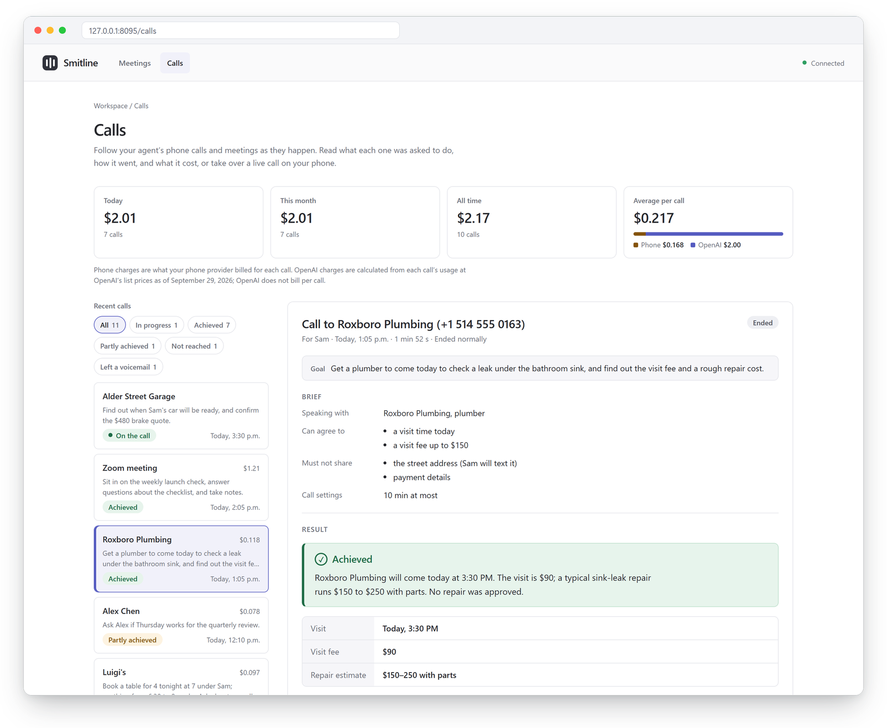
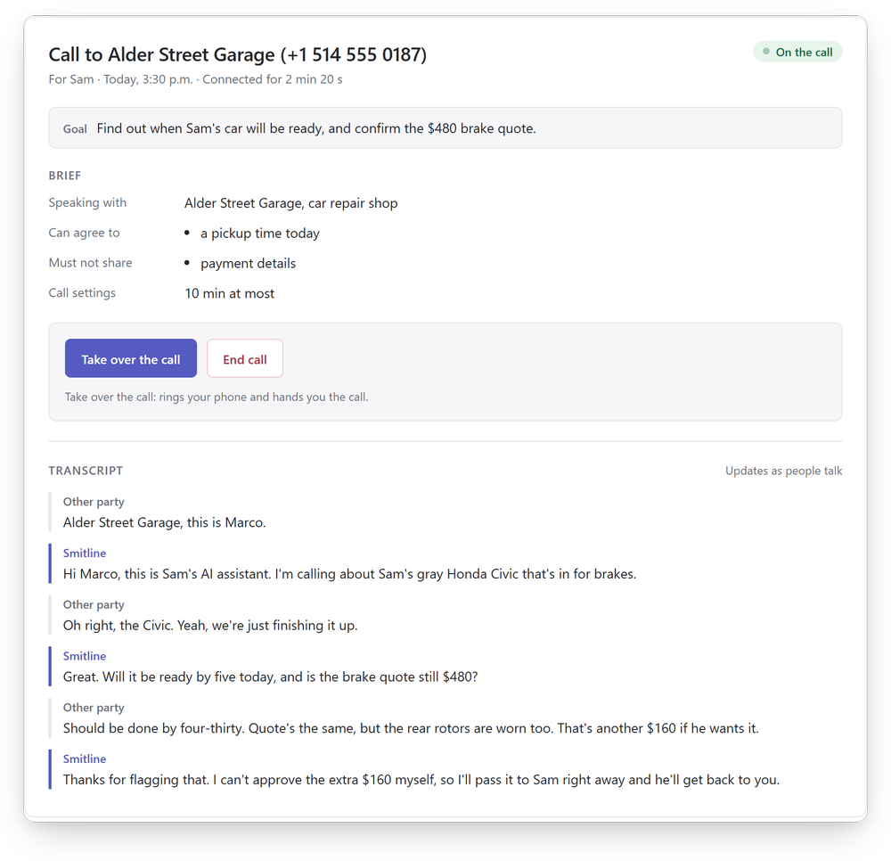
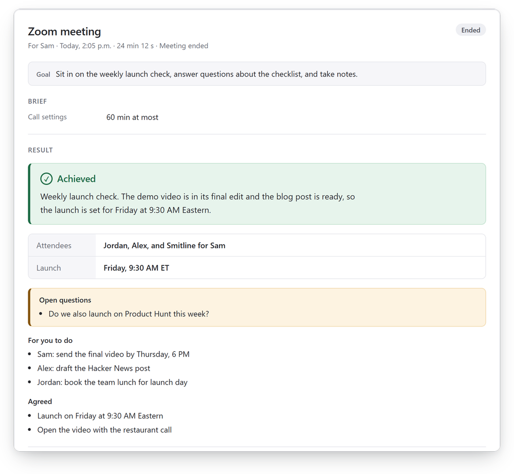
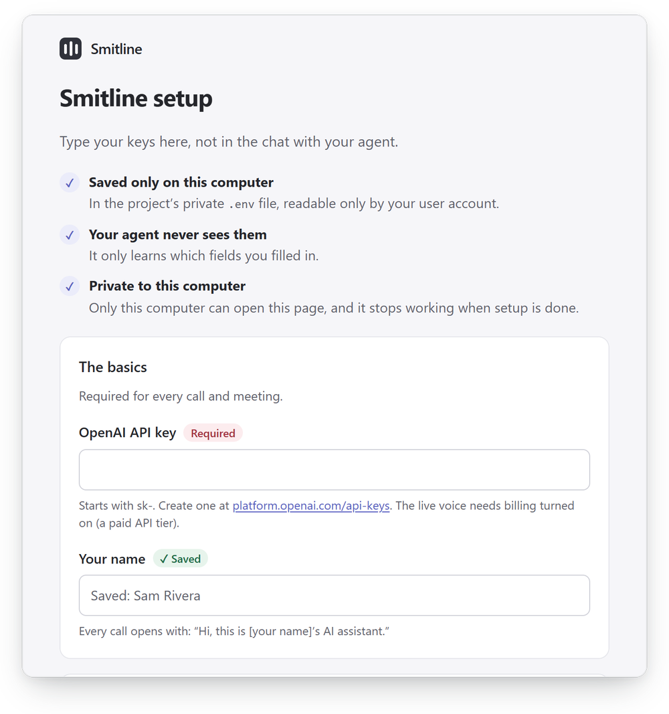

<p align="center">
  <picture>
    <source media="(prefers-color-scheme: dark)" srcset="docs/images/logo-dark.png">
    
  </picture>
</p>

<h3 align="center">Your agent can make the call.</h3>

<p align="center">
  Phone calls and meetings for any AI agent. Smitline gives your agent a phone line and a seat in Zoom, Microsoft Teams and Google Meet, talks with people in real time, and reports back to the chat that sent it.
</p>

<p align="center">
  <a href="LICENSE"></a>
  <a href="https://github.com/kaelorlabs/smitline/tags"></a>
  <a href="https://github.com/kaelorlabs/smitline/pkgs/container/smitline"></a>
</p>

<p align="center">
  <a href="#get-started"><b>Get started</b></a> · <a href="#how-it-works">How it works</a> · <a href="#safe-by-default">Safety</a> · <a href="#documentation">Docs</a>
</p>

<p align="center">
  
</p>

## What it does

Ask your agent the way you'd ask a good assistant:

> "Call Luigi's and book a table for 4 at 7."<br>
> "Call the plumber and see if they can come today. Don't agree to more than $150."<br>
> "Join my 3 PM Zoom and take notes for me."

Smitline makes the call, talks with whoever answers in a natural voice, and sends the result back to your chat: what happened, the details you need (times, prices, confirmation numbers), decisions, action items, the full transcript, and what the call cost.

- **Calls anyone.** Restaurants, offices, plumbers, friends, using your own number through your SignalWire or Twilio account.
- **Joins meetings.** Zoom, Microsoft Teams and Google Meet, as a participant that listens and answers when it's spoken to.
- **Works with your agent.** Claude Code, Codex, Cursor, Claude Desktop, OpenClaw, Hermes, and anything that can use MCP, a CLI or a REST API.
- **Runs on your computer.** One Docker container, your own OpenAI and phone keys, open source under Apache-2.0.

## How it works

1. **You ask your agent.** It writes a short brief: the goal, what to find out, what it may agree to, and what to keep private.
2. **Smitline makes the call.** It opens by saying it's your AI assistant, then talks in real time using OpenAI's GPT-Live, staying inside the brief.
3. **You can follow along.** The dashboard on your computer shows the live transcript, and you can take the call over on your own phone at any moment.
4. **The result comes back** to the chat that asked: the outcome, the details, action items, the transcript, and the cost.

<p align="center">
  
  
</p>
<p align="center"><sub>Left: a call in progress. The garage suggests an extra $160 repair, and Smitline brings it back to you instead of approving it. Right: what comes back after a meeting.</sub></p>

## Get started

Paste this into your agent (Claude Code, Codex, Cursor, OpenClaw, Hermes or similar):

```text
Set up Smitline for me from https://github.com/kaelorlabs/smitline. Follow SETUP.md in that repository. Ask me only what you need, and never ask me to paste keys into this chat.
```

Your agent starts Smitline with one Docker command, opens a setup page on your computer for your keys, rings your phone so you can hear it, and connects itself. Your keys go into that page, never into the chat. Your agent may ask you to run the Docker command yourself, because it gives Smitline access to Docker for meetings; that's expected.

<p align="center">
  
</p>

**What you need**

- **Docker:** Docker Desktop on Mac or Windows (4.34 or newer, signed in), or Docker Engine on Linux. On Docker Desktop, turn on host networking first: Settings > Resources > Network > **Enable host networking**, then **Apply and restart**. Without it, the dashboard at 127.0.0.1:8095 never loads.
- **OpenAI:** an API key with access to GPT-Live (billing turned on).
- **For phone calls:** a SignalWire account (the free trial calls numbers you verify) or a funded Twilio account.
- **For meetings:** nothing more. Smitline joins through the browser, like a guest.
- **Disk space:** about 600 MB to download, plus 1.8 GB the first time it joins a meeting.

With these ready, setup takes about 10 minutes.

A call costs about 6 cents a minute with SignalWire: roughly $0.008 for the phone line and $0.05 for GPT-Live. A two-minute test call to a plumber cost us 14 cents.

Then just ask: *"Call +1 … and …"*, *"Practice the call on me first"*, or *"Join this meeting: &lt;link&gt;"*. The dashboard is at http://127.0.0.1:8095.

<details>
<summary>Prefer to set it up yourself?</summary>

[SETUP.md](SETUP.md) has every step. Smitline itself is one command:

```bash
docker run -d --name smitline --restart unless-stopped --network host -v smitline:/data -v /var/run/docker.sock:/var/run/docker.sock ghcr.io/kaelorlabs/smitline
```

The Docker socket (`-v /var/run/docker.sock…`) lets Smitline start its meeting container, and it gives the container control of Docker on your computer, which is close to administrator access. If you only want phone calls, leave it out:

```bash
docker run -d --name smitline --restart unless-stopped --network host -v smitline:/data ghcr.io/kaelorlabs/smitline
```

In Git Bash on Windows, put `MSYS_NO_PATHCONV=1 ` in front of the command. Then run `docker exec smitline smitline setup secrets` to open the setup page.

</details>

## Safe by default

- **Always says it's an AI.** Every call opens with "Hi, this is *your name*'s AI assistant", and Smitline checks that it was said.
- **Stays inside the brief.** It agrees only to what you allowed and never shares what you marked private. Anything else, it brings back to you.
- **Guardrails on every call.** It never dials emergency or premium-rate numbers, calls only between 8 AM and 9 PM in the other person's time zone, stops calling anyone who asks it to, and limits repeat calls.
- **Docker access is your choice.** Meetings need Smitline to start its own meeting container, so the setup mounts the Docker socket. Phone calls work without it.
- **Your keys and records stay with you.** Keys are typed into a page on your computer, and call records and transcripts are stored there too. Audio goes to OpenAI and your phone provider; nothing goes to us, because there is no Smitline server.

More in [security and privacy](docs/security.md) and the [phone guardrails](docs/phone.md#guardrails).

## Limitations

- Phone calls are in daily use through SignalWire. Meetings are tested live in Zoom; Teams and Google Meet use the same runtime but have had less live testing.
- Replies come after a short pause, so a call feels a little slower than talking to a person. Call audio passes through your computer on its way to OpenAI.
- Trial phone accounts call only numbers you verify, and Twilio's free trial can't carry a live call.
- Smitline works while your computer is on; there is no hosted version yet.
- In meetings, guidance goes in the brief before it joins, and it doesn't share or read screens.

## Documentation

| Guide | What's in it |
| --- | --- |
| [Calls](docs/calls.md) | Briefs, results, costs and the REST API |
| [Phone calls](docs/phone.md) | SignalWire and Twilio, guardrails, recording, settings |
| [Meetings](docs/meetings.md) | Joining Zoom, Teams and Meet, and the meetings console |
| [Agents](docs/agents.md) | MCP, the CLI, SDKs, and the remote connector for cloud agents |
| [Security and privacy](docs/security.md) | What stays local, what goes where, and how it's protected |
| [Architecture](docs/architecture.md) | How the pieces fit together |
| [Development](docs/development.md) | Running from a checkout, tests, project layout |
| [Troubleshooting](docs/troubleshooting.md) | Common problems and fixes |
| [Roadmap](docs/product-roadmap.md) | What's next |

## Contributing

Contributions are welcome. Start with [AGENTS.md](AGENTS.md), written for both people and coding agents, and the [development guide](docs/development.md). To report a security issue, see [SECURITY.md](SECURITY.md).

## Credits and license

Created by Ankit Luthra, Jiayi Shen, Lourd Arun Raj, Nomanina Ravaloson, and Vinny Palumbo. Smitline uses portions of Joinly's browser and audio infrastructure; see [THIRD_PARTY.md](THIRD_PARTY.md).

Smitline is licensed under the [Apache License 2.0](LICENSE). The vendored Joinly source in `joinly/` keeps its MIT license; see [NOTICE](NOTICE).
