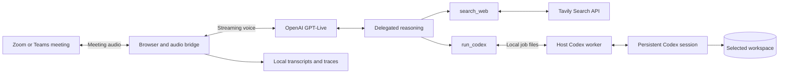

<div align="center">

# Colleague AI

### Bring your coding agent into the conversation.

A voice teammate for Zoom and Microsoft Teams that connects your team to Codex, its chosen workspace, and web search.

[Get started](#get-started) · [Try a conversation](#try-a-conversation) · [How it works](#how-it-works) · [Roadmap](#roadmap)

**Local-first meeting orchestration · Cloud voice and reasoning · Operator-controlled tools**

</div>

---

## From a meeting question to a useful answer

Your team is already talking. Someone needs an answer, a technical explanation, a review of project material, or current public information. Colleague AI brings that work into the call through a voice interface connected to tools.

Give it a Zoom or Teams invite from your coding-agent workflow, start the local bridge, and admit **Colleague AI** to the meeting. It listens continuously and GPT-Live responds selectively when it is directly addressed, receives an explicit task, or can establish an important factual correction. The local audio gate handles transport and platform mute state without making turn-taking decisions.

The current product runs locally and has been exercised in live Zoom calls. Conversational timing and meeting compatibility are still being improved.

## What you can do

| Capability | Experience |
| --- | --- |
| **Talk with an agent in Zoom** | Meeting audio streams to GPT-Live; replies play through the participant’s virtual microphone. |
| **Bring Codex into the discussion** | Delegate technical analysis and database queries to a read-only Codex session. Select a model for each task. |
| **Keep a technical session going** | Later tool calls resume the Codex session associated with the same meeting URL, including after a worker restart. |
| **Work with real project context** | Give Codex read-only access to an explicit workspace containing the code, documents, or data relevant to the meeting. |
| **Research current information** | Use a local `search_web` function backed by Tavily and return source-backed answers. |
| **Control participation** | Let GPT-Live handle pauses, backchannels, and interruptions while the local runtime safely transports only the speech it generates. |
| **Review what happened** | Save incremental transcripts, tool events, and generated charts locally. |

Chart rendering works locally. Sending chart attachments to Zoom chat is experimental and has **not** passed an end-to-end delivery test. Automatic screen sharing and post-meeting chat delivery are not implemented.

## Get started

### Prerequisites

- macOS or Linux, with Python 3.10+, Node.js 22+, npm, and Git. The host worker uses Unix file locking.
- Docker with Docker Compose, running locally.
- An authenticated Codex CLI: run `codex login` and verify with `codex login status`.
- An OpenAI project API key with access to the configured `gpt-live-1` voice model and `gpt-5.6-terra` backend. This prototype depends on those APIs being available to your account.
- A Tavily API key for web search.
- A Zoom or Teams meeting that permits the agent to join through the web client.

### 1. Clone and configure

```bash
git clone https://github.com/ankitluthra/colleague-ai-private.git
cd colleague-ai-private
cp .env.example .env
cp meeting-runtime/meeting.env.example .env.meeting
chmod 600 .env .env.meeting
npm install
```

Edit `.env` with your own keys:

```dotenv
OPENAI_API_KEY=your_openai_project_key
TAVILY_API_KEY=your_tavily_key
```

Meeting details can be entered in the control panel. To configure them manually instead, edit `.env.meeting`:

```dotenv
MEETING_URL=https://us05web.zoom.us/j/YOUR_MEETING_ID
MEETING_PASSCODE=your_meeting_passcode
COLLEAGUE_PARTICIPANT_NAME=Colleague AI
COLLEAGUE_CODEX_MODEL=gpt-5.6-terra
COLLEAGUE_ENABLE_WEB_SEARCH=1
COLLEAGUE_ENABLE_CODEX=1
COLLEAGUE_ENABLE_CHARTS=0
COLLEAGUE_WORKSPACE=
COLLEAGUE_MEETING_INSTRUCTIONS=
```

You can use the full Zoom invite URL, including its `pwd` query parameter. Supply the passcode separately if the web client asks for it. Keep these files private; they are ignored by Git.

### 2. Open the meeting console

```bash
bash start-control-panel.sh
```

Open [http://127.0.0.1:8095](http://127.0.0.1:8095). Paste a Zoom or Teams invite, choose the Codex model, tools, optional read-only workspace, and any meeting-specific guidance. You can also paste private reference text or upload TXT, Markdown, CSV, JSON, YAML, PDF, and DOCX files. Run the checks and start the colleague. The console shows the join stage, microphone and listening state, runtime log, and local meeting transcripts. It writes meeting settings to the ignored `.env.meeting` file; API keys remain in the ignored `.env` file and are never returned to the browser.

Uploaded documents are converted to text and stored locally in the ignored `meeting-runtime/context/index.json`. Their contents are not returned in the browser bootstrap response. When the meeting touches supplied company facts, project details, policies, plans, metrics, customers, or terminology, the agent can call the local `search_context` function and answer from matching passages while naming the source document. Clear saved context from the console when it should no longer be available.

The launcher validates the configuration without printing secrets, verifies the services required by the selected tools, builds the Docker images, starts the meeting browser participant, and runs the Codex worker on the host when enabled. Keep the console terminal open while using the agent.

The first build can take several minutes. The shared Joinly base image includes local speech-model dependencies, although the Zoom audio path uses GPT-Live rather than those models.

If the launcher cannot locate Codex, set its executable explicitly:

```bash
CODEX_BIN=/path/to/codex bash start-meeting-agent.sh
```

The command-line launcher remains available for automation or debugging:

```bash
bash start-meeting-agent.sh
```

See the [local control panel guide](docs/control-panel.md) for the complete operator workflow, reference-context behavior, local storage, and troubleshooting.

### 3. Admit and unmute

Admit **Colleague AI** if it enters the waiting room. It listens continuously, opens its meeting microphone only while delivering a reply, and remutes after playback.

| Local interface | Address |
| --- | --- |
| Meeting operations console | http://127.0.0.1:8095 |
| Agent browser viewer | http://127.0.0.1:6082/vnc.html?autoconnect=true |
| Status, transcripts, and tool activity | http://127.0.0.1:8094/health |

A `live` status indicates the bridge reached the meeting audio loop. Verify a spoken exchange to confirm the complete audio path.

### Stop or switch meetings

Stop the host worker with **Ctrl-C**, then stop the meeting participant:

```bash
docker compose -f compose.meeting.yaml stop meeting-agent
```

For another meeting, update `.env.meeting` and run the launcher again. Configuration and voice-session instructions are loaded at startup. After changing them on a running instance:

```bash
./start-meeting-agent.sh
```

Recreation interrupts the current call and creates a new voice session.

## Try a conversation

Unmute the agent, then try:

> “Search for the latest release notes for the API we are discussing and tell us whether this behavior changed.”

> “Ask Codex using GPT-5.6 Terra to review a retry strategy for a Python service.”

> “Inspect the CSV in the workspace, calculate monthly conversion, and plot the trend.”

> “Summarize the decision we just made and identify the unresolved question.”

The technical worker has access only to the workspace selected in the console. When no workspace is selected it uses the empty, ignored `meeting-runtime/codex-workspace` directory. Codex runs read-only: it can inspect, query, calculate, explain, and plan, but it does not modify workspace files through this tool.

## How it works



The meeting browser, virtual display, and audio bridge run in Docker. The Codex worker runs on the host to reuse your existing CLI login; Codex credentials are not copied into the container.

The backend exposes two local functions:

| Function | Purpose |
| --- | --- |
| `search_web(query)` | Research public information through Tavily. |
| `search_context(query)` | Retrieve relevant passages from locally supplied notes and documents. |
| `run_codex(task, model)` | Run read-only technical analysis or SQL queries using a resumable Codex session. |

The model allowlist is defined in [`meeting-runtime/codex_tool.py`](meeting-runtime/codex_tool.py). The default is `gpt-5.6-terra`; the implementation also allows `gpt-6-astra`, `gpt-5.6-sol`, `gpt-5.6-luna`, and `gpt-5.5`, subject to account access.

Codex receives the context included in each delegated task. It does **not** automatically receive all background meeting speech. Session identity is derived from the full meeting URL; changing that URL creates a separate Codex session.

## Data and privacy

- **OpenAI:** meeting audio is sent to the voice API. Delegated reasoning and Codex receive the relevant text and tool context. These services use your account’s billing or allowance.
- **Tavily:** search queries are sent to Tavily using your API key.
- **Local storage:** supplied context is stored as extracted text in `meeting-runtime/context/index.json`. Each call creates `meeting-runtime/recordings/<timestamp>-<id>/` with `transcript.txt` and `events.jsonl`. Charts and chart data are stored alongside them when generated.
- **Credentials and runtime files:** keys, meeting invites, job files, Codex session mappings, databases, and recordings are excluded from Git. Local status and viewer ports bind to localhost.

Transcripts and traces contain meeting content and are retained until you remove them. Generated agent text may represent speech that was muted or interrupted. The recorder does not save raw audio or a complete restorable copy of the voice model’s internal context. Restarting starts a fresh voice context even when the Codex tool session is resumed.

## Development

| Path | Responsibility |
| --- | --- |
| [`meeting-runtime/`](meeting-runtime/) | Meeting adapters, local tools, Codex worker, transcripts, and tests |
| [`gpt-live/`](gpt-live/) | Standalone browser voice diagnostic and Node.js session gateway |
| [`live/`](live/) | Earlier local voice-room experiment |
| [`joinly/`](joinly/) | Vendored meeting/browser/audio infrastructure |
| [`agents-everywhere-starter-kit/`](agents-everywhere-starter-kit/) | CopilotKit starter reference; not integrated into the active voice path |

Run the meeting runtime suite using the built image:

```bash
docker run --rm \
  --entrypoint /app/.venv/bin/python \
  -v "$PWD/meeting-runtime:/meeting-runtime:ro" \
  meeting-agent-joinly-login:local \
  -m unittest discover -s /meeting-runtime -p 'test_*.py'
```

Run the standalone voice gateway tests with Node.js 22.6+:

```bash
node --test gpt-live/server.test.mjs
```

Unit tests do not establish live Zoom admission, audio quality, or successful file delivery. Test those in a meeting after changing browser or audio behavior.

## Troubleshooting

| Symptom | Check |
| --- | --- |
| Agent is silent | Address it directly with a question or task, then inspect `floorState`, `microphoneState`, `stage`, and errors at `/health`. |
| Codex tool fails | Keep the launcher terminal open and verify the host CLI login. A worker lock means another worker is already running. |
| Chat attachment is unavailable | The host must allow file transfer and the web client must expose a File control. Delivery remains experimental. |
| Agent cannot enter the meeting | Inspect the local browser viewer for waiting-room, sign-in, passcode, or host-removal messages. |
| Voice API rejects the session | Check account access to the configured voice and backend models, keys, and service errors. |

## Roadmap

See the [product roadmap](docs/product-roadmap.md) for the production milestones and release criteria.

- Reduce voice and tool-response latency.
- Evaluate selective participation and conversational timing across larger meetings.
- Make chart attachment delivery reliable and visibly confirmed.
- Add meeting summaries and actionable follow-ups.
- Broaden meeting-platform support. Zoom and Teams are supported; Google Meet experiments are included but are not verified.

## Credits and upstream work

Created by Ankit Luthra, Jiayi Shen, Lourd Arun Raj, Nomanina Ravaloson, and Vinny Palumbo.

Colleague AI builds on Joinly’s browser and audio infrastructure. The repository also retains the CopilotKit Agents Everywhere starter as a reference. See [THIRD_PARTY.md](THIRD_PARTY.md) for pinned upstream revisions and retained licenses. Upstream license terms apply to those components; they do not imply a repository-wide license for our additions.

## Zoom and Teams adapters

See [meeting adapters](docs/meeting-adapters.md) for Microsoft account connection, guest fallback, automatic microphone handling, breaking configuration changes, and current test coverage. See [coding providers](docs/coding-providers.md) for Codex, Cursor, and Claude Code capability detection and login. GPT-Live stays connected throughout the meeting to preserve original audio context and continues using the API while listening.
