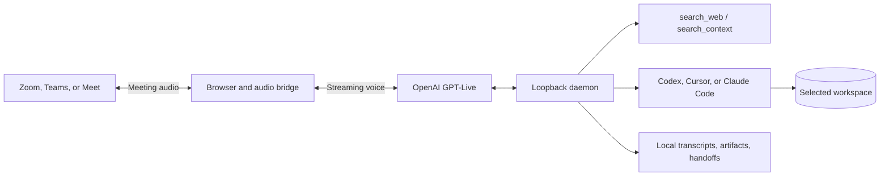

<div align="center">

# Colleague AI

### Your agent can make the call.

Give any AI agent a phone line and a seat in Zoom, Microsoft Teams, and Google Meet. Colleague AI talks with people in real time using GPT-Live, then reports back to the chat that sent it.

[Get started](#get-started) · [Calls](docs/calls.md) · [Phone](docs/phone.md) · [Agents](docs/agents.md) · [Architecture](#architecture) · [Troubleshooting](#troubleshooting)

**Self-hosted · Your own keys · Apache-2.0**

</div>

---

Tell your agent "call Luigi's and book a table for 4 at 7" or "join this meeting and help with the Q3 numbers". The agent writes a brief, Colleague AI holds the conversation, and a structured result comes back: the outcome, a summary, details such as confirmation numbers, decisions, action items, open questions, and the transcript. Phone calls go through your SignalWire or Twilio account; meetings are joined by a browser participant on your computer.

Colleague AI is also another interface to the coding-agent conversation you already have. A host integration (or the local portal) joins a meeting with context and permissions; GPT-Live listens continuously and speaks selectively; delegated work resumes the originating coding-agent session when the host supplies that session’s real id. When the meeting ends, a structured handoff is appended once and the session lease is released.

Read the [product vision, decisions, and progress ledger](docs/product-vision-and-progress.md) before making substantial product or architecture changes. Humans and coding agents should start from [AGENTS.md](AGENTS.md) for the full doc index and invariants.

The supported production path is a **loopback daemon on this computer** (`127.0.0.1`). There is no production hosted control plane. The [hosted runtime](docs/hosted-runtime.md) module is a foundation for later pairing tests, not a cloud deployment.

The current product has been exercised in live Zoom calls. Teams and Google Meet share the same local browser/audio runtime; live tenant policies still need acceptance testing. Conversational timing is still being improved.

Phone calls were first placed live on 2026-09-29 through SignalWire: a setup call to the owner and a call that scheduled a meeting with a colleague both came back with the right result. Phone conversation is not yet as natural as ChatGPT voice, because call audio currently passes through this computer; connecting the phone provider straight to OpenAI over SIP is in progress. See [Limitations](#limitations).

## What you can do

| Capability | Experience |
| --- | --- |
| **Make phone calls** | Your agent sends a brief; Colleague AI calls through SignalWire (free trial works) or Twilio, opens with an AI disclosure, and returns the outcome, details, and transcript. Rehearse on your own phone first, follow the live transcript, or take the call over on your own phone. |
| **Work with any agent** | Local agents use MCP tools or the CLI; cloud agents use the remote connector; anything else uses the REST API. |
| **Talk in Zoom, Teams, or Meet** | Meeting audio streams to GPT-Live; replies play through the participant’s virtual microphone after a short opening AI disclosure. |
| **Bring a coding agent in** | Codex is the default. Cursor and Claude Code are optional adapters that only use flags documented by their CLIs. |
| **Keep one technical session** | Exact continuity resumes the host-supplied thread id. Context continuity (`local-portal`) does not invent or hash a thread. |
| **Work with an explicit workspace** | The worker can inspect the selected directory. Approved mutations run in an isolated worktree, not through Cursor/Claude CLIs. |
| **Research current information** | Optional local `search_web` backed by Tavily. |
| **See Colleague AI in the call** | Virtual camera is on by default and never displays task text. Disable it to join audio-only. |
| **Understand shared slides** | Incoming shared-content capture is **opt-in and off by default**. Voice cannot enable it. Outgoing desktop share from this computer is not implemented. |
| **Approve risky work** | Commands, edits, network, commits, and pushes can require a single operator decision. |
| **Review what happened** | Local transcripts, handoffs, artifacts, and (when generated) charts. |

Chart rendering works locally. Sending chart attachments to Zoom chat is experimental and has **not** passed an end-to-end delivery test. Post-meeting chat delivery is not implemented.

## Architecture

See [architecture](docs/architecture.md) for sequence diagrams (join/admission, selective speech, exact-session handoff, approval-gated workspace actions, guest-then-signed-in fallback) and [retention paths](docs/architecture.md#retention-and-deletion). See [capabilities](docs/capabilities.md) for Zoom / Teams / Meet and Codex / Cursor / Claude Code matrices.



The meeting browser, virtual display, virtual camera, and audio bridge run in Docker. Coding-agent CLIs run on the host so official logins are not copied into the container. GPT-Live keeps **one continuous `gpt-live-1` session** from admission to shutdown (`store: false`).

## Security model

- **Loopback by default.** The runtime daemon binds `127.0.0.1` with a per-launch bearer token in `.colleague/daemon.auth`. Public binds are rejected unless server mode is turned on with a long-lived API token (see [calls](docs/calls.md#access)). Only the phone gateway's Twilio routes, which check Twilio signatures, are exposed through a tunnel.
- **Host-owned secrets.** OpenAI, SignalWire or Twilio, and Tavily keys stay in ignored `.env`, typed into a one-time local page rather than an agent chat. Browser profiles, transcripts, jobs, artifacts, and pairing hashes stay on disk and gitignored. They are never uploaded to the mock hosted plane.
- **Least privilege.** Hosted/remote requests may only **narrow** local permissions. The local runner is the final enforcement point.
- **Fail closed.** Unknown provider ids, undocumented CLI flags, `last`/`latest` session ids, and missing job bindings are rejected.
- **No secret-bearing logs.** Pairing codes and `deviceEnrollment` are revealed once. Tokens are not placed in URLs, query strings, events, or errors.
- **Operator mute is authoritative.** Colleague AI does not unmute itself after a host or participant mute. It accepts only an explicit host request, such as Zoom's "Ask to unmute".

## Prerequisites

- macOS or Linux (Windows through WSL2), Node.js 22+, npm, Git, and Docker. The runtime daemon runs in Docker when this computer has no Python 3.10+ with venv; handing meeting work to a coding agent needs that Python, because the agent runs on this computer with your logins. Host workers use Unix file locking.
- On Windows, use WSL2 with Ubuntu: install Docker inside WSL (or enable Docker Desktop's WSL integration) and clone the repository inside the Linux home directory, not under `/mnt/c` or `/mnt/d`. `npm run doctor` checks for this.
- Docker with Docker Compose, running locally.
- An OpenAI project API key with access to `gpt-live-1` and the configured Codex backend model (default `gpt-5.6-terra`).
- Optional: Tavily API key for web search.
- Optional coding-agent CLIs you actually enable: `codex login` (default), Cursor `cursor-agent`, or Claude Code `claude`. See [coding providers](docs/coding-providers.md).
- A Zoom, Teams, or Google Meet meeting that permits the agent to join through the web client.

## Get started

Copy this prompt into your coding agent (Claude Code, Codex, Cursor, OpenClaw, Hermes, or similar):

```text
Set up Colleague AI for me from https://github.com/kaelorlabs/colleague-ai. Follow SETUP.md in that repository. Ask me only what you need, and never ask me to paste keys into this chat.
```

The agent follows [SETUP.md](SETUP.md). It checks your computer, opens a page in your browser where you enter your keys, your name, and (for phone calls) your SignalWire details and phone number, rings your phone so you hear Colleague AI, and then connects itself. You change the voice any time by asking your agent. Keys stay in the ignored `.env` file and never pass through the agent.

Then ask your agent: "Call +1 … and …", "Practice the call on me first", or "Join this meeting: <link>".

**What phone calls need.** You need Node.js 22 and Docker, plus an OpenAI key with GPT-Live access for calls and meetings. For phone calls, you also need a phone provider account:

- **SignalWire, free trial.** No card needed. The trial calls only numbers you verify in SignalWire (up to 10, US and Canada): your own phone, and friends who read back a code.
- **SignalWire, paid.** Adding $5 of credit lets Colleague AI call any number, such as a restaurant. Calls cost about $0.008 a minute plus GPT-Live's $0.05.
- **Twilio.** Works only with an upgraded (funded) account. Twilio's free trial blocks the live audio Colleague AI needs.

To follow a call live, read its transcript as it happens, or take it over on your phone, run `./start-control-panel.sh` and open [http://127.0.0.1:8095/calls](http://127.0.0.1:8095/calls).

### Manual setup

For the agent-native Codex experience, register the local integration once:

```bash
bash scripts/install-codex-integration.sh
```

The installer adds an exact-continuity launcher at `~/.codex/bin/colleague`, registers the local MCP control server, and installs the `join-colleague-ai-meeting` Codex skill. Restart Codex, open the project you want Colleague AI to access, and ask it to join a meeting. The skill launches the CLI inside the active task, where it directly inherits `CODEX_THREAD_ID`, and supplies the current workspace plus a bounded context handoff. It fails closed instead of falling back to portal-style context continuity. MCP remains available for status and meeting controls; the portal remains an optional operations console.

Run the local diagnostic at any time:

```bash
npm run doctor
```

### 1. Clone and configure

```bash
git clone https://github.com/kaelorlabs/colleague-ai.git
cd colleague-ai
cp .env.example .env
cp meeting-runtime/meeting.env.example .env.meeting
chmod 600 .env .env.meeting
npm install
```

Edit `.env` with placeholders replaced by **your** keys:

```dotenv
OPENAI_API_KEY=replace_with_your_project_api_key
TAVILY_API_KEY=replace_with_your_tavily_api_key
```

Meeting details can be entered in the control panel. To configure them manually instead, edit `.env.meeting` using only placeholders from `meeting-runtime/meeting.env.example` (Zoom, Teams, or Meet HTTPS invites). Keep these files private; they are ignored by Git.

### 2. Open the meeting console (portal)

```bash
bash start-control-panel.sh
```

Open [http://127.0.0.1:8095](http://127.0.0.1:8095). Paste a Zoom, Teams, or Google Meet invite, choose **one** coding agent, tools, optional workspace, camera, and incoming shared-content capture. You can paste private reference text or upload TXT, Markdown, CSV, JSON, YAML, PDF, and DOCX files. Run the checks and start the colleague.

The portal talks to the **loopback daemon**. It starts `start-runtime-daemon.sh` when needed. API keys remain in `.env` and are never returned to the browser. Portal joins use **context continuity** (`local-portal`), not exact thread resume.

Uploaded documents are stored as extracted text in ignored `meeting-runtime/context/index.json`. The agent can call `search_context` when sources exist at voice-session startup.

The first Docker build can take several minutes. The Joinly base image includes historical local speech-model dependencies; the meeting audio path uses GPT-Live, not Whisper/Kokoro.

See the [control panel guide](docs/control-panel.md) for operator workflow and [meeting adapters](docs/meeting-adapters.md) for guest-then-signed-in fallback.

### 3. Admit the participant

Admit **Colleague AI** if it enters the waiting room. It unmutes its meeting microphone once, says a short AI disclosure naming who it acts for, then listens continuously. Between replies a local audio gate sends silence, so the platform shows it unmuted; it mutes the microphone when it leaves. Set `COLLEAGUE_MEETING_INTRO=0` in `.env` to skip the disclosure.

| Local interface | Address |
| --- | --- |
| Meeting operations console | http://127.0.0.1:8095 |
| Calls (live transcript, results, take over) | http://127.0.0.1:8095/calls |
| Agent browser viewer | http://127.0.0.1:6082/vnc.html?autoconnect=true |
| Status, transcripts, and tool activity | http://127.0.0.1:8094/health |
| Runtime daemon (loopback) | http://127.0.0.1:8765 |

A `live` health status indicates the bridge reached the meeting audio loop. Verify a spoken exchange to confirm the complete audio path.

### Stop or switch meetings

Stop the colleague from the portal, or stop the host worker with **Ctrl-C**, then:

```bash
docker compose -f compose.meeting.yaml stop meeting-agent
```

Configuration and voice-session instructions are loaded at startup. Recreating the participant interrupts the current call and creates a new voice session.

The command-line launcher remains available for automation:

```bash
bash start-meeting-agent.sh
```

Old Zoom-specific paths (`compose.zoom.yaml`, `.env.zoom`, `start-zoom-agent.sh`) are **not** read. Use `meeting-runtime/`, `.env.meeting`, `MEETING_URL`, `compose.meeting.yaml`, service `meeting-agent`, and `start-meeting-agent.sh`. Move existing local jobs, workspace, context, and recordings with the runtime directory.

## Daemon, portal, SDK, CLI, and MCP

| Surface | Role |
| --- | --- |
| **Daemon** | `./start-runtime-daemon.sh` — loopback HTTP + SSE, bearer auth, calls, meetings, approvals, artifacts, git, screen-share, providers, runner pairing |
| **Calls API** | `/v1/calls` — any agent sends a brief (phone number or meeting link, goal, context) and reads a structured result. See [calls](docs/calls.md) and `/v1/openapi.json`. |
| **Phone gateway** | `127.0.0.1:8766` — the only Twilio-facing routes, exposed through a quick tunnel or your proxy. See [phone calls](docs/phone.md). |
| **Portal** | `./start-control-panel.sh` — operator UI; context continuity only |
| **TypeScript SDK** | `@colleague-ai/sdk` — host integrations; not published to npm |
| **Python SDK** | `colleague-ai` — same contract; not published to PyPI |
| **CLI** | `packages/cli` — `colleague call\|calls\|voices\|setup` for calls and setup; `colleague join\|status\|cancel\|handoff\|approvals\|artifacts\|…` for meetings |
| **MCP** | `packages/mcp` — stdio adapter over the TypeScript SDK; stdout is JSON-RPC only |
| **Remote connector** | `./start-connector.sh` — MCP over HTTPS with OAuth sign-in, so cloud agents such as ChatGPT and Claude can place calls; call tools only, and the daemon stays on loopback. See [agents](docs/agents.md). |

Exact continuity: pass the real originating `sessionId` (for Codex, the host thread id). Never `last`, `latest`, `--last`, or a URL hash.

```bash
colleague join \
  --meeting "https://us05web.zoom.us/j/YOUR_MEETING_ID" \
  --agent codex \
  --thread "$CODEX_THREAD_ID" \
  --workspace "$PWD" \
  --wait
```

`--context-continuity` joins without an originating thread. `--no-camera` is audio-only. `--screen-share` opts in to incoming shared-content capture.

## Exact vs context continuity

| Mode | Who uses it | `sessionId` | Behavior |
| --- | --- | --- | --- |
| **exact** | Codex/Cursor/Claude host integrations that already have the live thread id | Real originating id | Exclusive lease; resume that thread; append handoff once |
| **context** | Local portal, generic MCP clients, `--context-continuity` | `local-portal` | Pass structured context only; do not claim thread resume |

Cursor and Claude Code reject exact mode when their CLI help does not document resume.

## Approvals, artifacts, camera, and screen share

- **Approvals** appear in the portal, `colleague approvals`, SDK handles, and MCP tools. One decision per request: approved or denied. There is no approve-all.
- **Artifacts** (plans, patches, command logs, screenshots, observations) stay in `.colleague/daemon-data/.colleague/artifacts/`. Metadata can be listed; bytes are local.
- **Virtual camera** shows listening / working / speaking presence, never task text. Uncheck **Show in the meeting** for audio-only. If the host blocks video, audio continues.
- **Incoming screen share** captures the meeting’s share/presentation surface at a low rate when enabled at join. Off by default. Pause/resume from portal, CLI, SDK, or MCP. Voice cannot turn it on. A frame is analyzed only after the screen settles and changes meaningfully; returning to an earlier screen reuses its observation. See [change detection](docs/architecture.md#incoming-shared-content-change-detection).

## Hosted runtime foundation

Pairing a runner (`colleague runner pair`, portal **Pair runner**, SDK/MCP equivalents) issues a short-lived one-time code. Local loopback remains the supported mode. Credentials, profiles, workspace bytes, transcripts, and screenshots do not leave this computer. See [hosted runtime](docs/hosted-runtime.md).

## Try a conversation

Unmute the agent, then try:

> “Search for the latest release notes for the API we are discussing and tell us whether this behavior changed.”

> “Ask Codex using GPT-5.6 Terra to review a retry strategy for a Python service.”

> “Inspect the CSV in the workspace, calculate monthly conversion, and plot the trend.”

> “Summarize the decision we just made and identify the unresolved question.”

The technical worker has access only to the workspace selected in the console. When no workspace is selected it uses the empty, ignored `meeting-runtime/codex-workspace` directory. Codex analysis through `run_codex` is read-only. Approved workspace edits, if you allow them, run in an isolated git worktree.

## How tools reach the voice model

GPT-Live client-delegates coding work. There is no extra Responses model between Live and the coding-agent CLI.

| Function | Purpose |
| --- | --- |
| `search_web(query)` | Public research through Tavily when enabled. |
| `search_context(query)` | Passages from locally supplied notes and documents. |
| Coding-agent delegation | Bounded task to Codex, or to Cursor/Claude Code when enabled and capable. |

The Codex model allowlist is defined in [`meeting-runtime/codex_tool.py`](meeting-runtime/codex_tool.py). The default is `gpt-5.6-terra`; `gpt-6-astra`, `gpt-5.6-sol`, `gpt-5.6-luna`, and `gpt-5.5` are also listed, subject to account access. Cursor and Claude Code do not guess model names.

Delegated tasks receive the context included in that request. They do **not** automatically receive all background meeting speech.

## Data and privacy

- **OpenAI:** meeting audio is sent to the voice API. Delegated reasoning receives the relevant text and tool context. These services use your account’s billing or allowance.
- **Tavily:** search queries are sent to Tavily using your API key when web search is enabled.
- **Local storage:** see [retention and deletion](docs/architecture.md#retention-and-deletion). Transcripts, profiles, jobs, artifacts, and pairing hashes are gitignored.

Transcripts contain meeting content and are retained until you remove them. Generated agent text may represent speech that was muted or interrupted. The recorder does not save raw audio. Restarting starts a fresh voice context even when a coding-agent thread can be resumed.

## Development

| Path | Responsibility |
| --- | --- |
| [`meeting-runtime/`](meeting-runtime/) | Adapters, daemon, providers, transcripts, tests |
| [`control-panel/`](control-panel/) | Local portal |
| [`packages/sdk-typescript/`](packages/sdk-typescript/) · [`packages/sdk-python/`](packages/sdk-python/) | Host SDKs |
| [`packages/cli/`](packages/cli/) · [`packages/mcp/`](packages/mcp/) | CLI and MCP adapter |
| [`gpt-live/`](gpt-live/) | Standalone browser voice diagnostic |
| [`joinly/`](joinly/) | Vendored meeting/browser/audio infrastructure |

```bash
docker run --rm \
  --entrypoint /app/.venv/bin/python \
  -v "$PWD/meeting-runtime:/meeting-runtime:ro" \
  meeting-agent-joinly-login:local \
  -m unittest discover -s /meeting-runtime -p 'test_*.py'

npm test
python3 -m unittest discover -s packages/sdk-python/tests -p 'test_*.py'
```

Unit tests do not establish live admission, audio quality, or file delivery. Test those in a real meeting after changing browser or audio behavior.

## Troubleshooting

| Symptom | Check |
| --- | --- |
| Agent is silent | Address it directly, then inspect `floorState`, `microphoneState`, `stage`, and `/health`. Unmute in the meeting UI if a host muted it. If `microphoneState` is `blocked` in Zoom, the host disabled self-unmute: the host can click **Ask to unmute** on its tile, and Colleague AI accepts. |
| Coding-agent tool fails | Keep the launcher terminal open. Verify the CLI login. A worker lock means another worker is already running. Cursor/Claude exact resume needs documented CLI flags. |
| Chat attachment is unavailable | Host must allow file transfer; Zoom upload remains experimental. |
| Agent cannot enter the meeting | Inspect the browser viewer for waiting-room, sign-in, passcode, or host-removal messages. Connect a Microsoft or Google account only as guest-denied fallback. |
| Voice API rejects the session | Check account access to the configured voice and backend models. |
| Daemon unauthorized | Token is in `.colleague/daemon.auth`; do not put it in a URL. Restart the daemon to rotate. |
| Shared-content capture idle | It is off unless enabled at join. Voice cannot enable it. |

## Limitations

- Not a multi-tenant hosted product. Loopback is the supported path.
- Quiet participation still uses the Live API; there is no `create_response: false`.
- Government Teams is not enabled. Meet URLs must be official `meet.google.com` 3-4-3 codes.
- Outgoing screen share from this computer is not implemented.
- Chart delivery into Zoom chat is experimental.
- Browser fixture tests are not production compatibility proof.
- Phone call audio currently travels phone provider → Cloudflare tunnel → this computer → OpenAI and back. The detour adds delay to every turn, so conversation feels less natural than ChatGPT voice. Talking over Colleague AI does not cut it off straight away, and a call can go quiet for a few seconds while it hangs up. Direct SIP, with audio straight between the provider and OpenAI, is being built.
- An automated call screener (on iPhone or Android) can be mistaken for voicemail, which makes the call end early and be reported as `voicemail`. A fix is in progress.
- Trial phone accounts call only verified numbers, and Twilio's free trial cannot carry a call at all. See [What phone calls need](#get-started).

## Roadmap

See the [product roadmap](docs/product-roadmap.md). Near-term work is direct SIP for phone calls (provider to OpenAI, with Colleague AI steering over a text side channel), latency, conversational timing, reliable chart delivery, summaries, and live tenant acceptance tests for Teams and Meet.

## Credits and upstream work

Created by Ankit Luthra, Jiayi Shen, Lourd Arun Raj, Nomanina Ravaloson, and Vinny Palumbo.

Colleague AI builds on Joinly’s browser and audio infrastructure. See [THIRD_PARTY.md](THIRD_PARTY.md) for the pinned upstream revision and retained license.

## License

Colleague AI is licensed under the [Apache License 2.0](LICENSE). The vendored Joinly source in `joinly/` keeps its MIT license; see [NOTICE](NOTICE) and [THIRD_PARTY.md](THIRD_PARTY.md).
