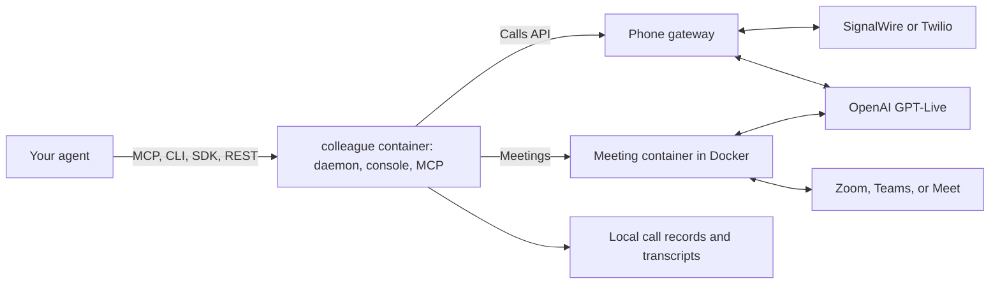

<div align="center">

# Colleague AI

### Your agent can make the call.

Phone calls and meetings for any AI agent. Colleague AI gives your agent a phone line and a seat in Zoom, Microsoft Teams, and Google Meet, talks with people in real time using GPT-Live, then reports back to the chat that sent it.

[Get started](#get-started) · [Calls](docs/calls.md) · [Phone](docs/phone.md) · [Agents](docs/agents.md) · [Architecture](#architecture) · [Troubleshooting](#troubleshooting)

**Self-hosted · Your own keys · Apache-2.0**

</div>

---

Tell your agent "call Luigi's and book a table for 4 at 7" or "join this meeting and help with the Q3 numbers". The agent writes a brief, Colleague AI holds the conversation, and a structured result comes back: the outcome, a summary, details such as confirmation numbers, decisions, action items, open questions, and the transcript. Phone calls go through your SignalWire or Twilio account; meetings are joined by a browser participant that runs in Docker on your computer.

OpenAI GPT-Live (`gpt-live-1`) is the only voice. It does all the listening and speaking, and hands harder questions to a backend model that knows the brief.

Read the [product vision, decisions, and progress ledger](docs/product-vision-and-progress.md) before making substantial product or architecture changes. Contributors, human or agent, should start from [AGENTS.md](AGENTS.md) for the doc index and invariants.

The supported path is a **loopback daemon on this computer** (`127.0.0.1`). There is no hosted service.

Phone calls were first placed live on 2026-09-29 through SignalWire: a setup call to the owner and a call that scheduled a meeting with a colleague both came back with the right result. Phone conversation is not yet as natural as ChatGPT voice, because call audio currently passes through this computer; connecting the phone provider straight to OpenAI over SIP is in progress. Meetings have been exercised in live Zoom calls; Teams and Google Meet share the same browser and audio runtime but still need live acceptance. See [Limitations](#limitations).

## What you can do

| Capability | Experience |
| --- | --- |
| **Make phone calls** | Your agent sends a brief; Colleague AI calls through SignalWire (free trial works) or Twilio, opens with an AI disclosure, and returns the outcome, details, and transcript. Rehearse on your own phone first, follow the live transcript, or take the call over on your own phone. |
| **Join Zoom, Teams, or Meet** | The same brief with channel `meeting` and the invite link. Meeting audio streams to GPT-Live; replies play through the participant's virtual microphone after a short AI disclosure. The result carries the summary, decisions, action items, and transcript. |
| **Work with any agent** | Local agents use MCP tools or the CLI; cloud agents use the remote connector; anything else uses the REST API or the SDKs. |
| **See what calls cost** | Every finished call carries its phone and OpenAI cost. The console's Calls page shows each call's brief, result, cost, and transcript, with spend totals. |
| **Give a meeting private context** | Paste text or add files in the console. The voice and its backend get it as background. |
| **Appear in the meeting** | A virtual camera shows listening, working, or speaking presence and never displays task text. Turn it off to join audio-only. |

## Architecture

See [architecture](docs/architecture.md) for the runtime pieces, sequence diagrams (joining a meeting, selective speech, guest-then-signed-in fallback), and [retention paths](docs/architecture.md#retention-and-deletion). See [capabilities](docs/capabilities.md) for the Zoom / Teams / Meet matrix.



Colleague AI runs as one container, `colleague`, which starts a second container, `colleague-meeting`, for each meeting: the meeting browser, virtual display, virtual camera, and audio bridge. GPT-Live keeps **one continuous `gpt-live-1` session** per call or meeting (`store: false`).

## Security model

- **Loopback by default.** The runtime daemon binds `127.0.0.1` with a per-launch bearer token in `.colleague/daemon.auth`. Public binds are rejected unless server mode is turned on with a long-lived API token (see [calls](docs/calls.md#access)). Only the phone gateway's routes, which check the provider's signatures, are exposed through a tunnel.
- **Host-owned secrets.** OpenAI and SignalWire or Twilio keys stay in the `colleague` data volume (the ignored `.env` in a checkout), typed into a one-time local page rather than an agent chat. Local agents reach the MCP endpoint with a local token; browsers are refused. Browser profiles, transcripts, call records, and context stay on disk and gitignored.
- **Fail closed.** Unknown fields, unsupported meeting links, and incomplete briefs are rejected with a readable reason.
- **No secret-bearing logs.** Tokens are not placed in URLs, query strings, events, or errors.
- **Operator mute is authoritative.** Colleague AI does not unmute itself after a host or participant mute. It accepts only an explicit host request, such as Zoom's "Ask to unmute".

## Prerequisites

- Docker: Docker Desktop on macOS or Windows (with host networking turned on), or Docker Engine on Linux or inside WSL2. Nothing else needs installing.
- An OpenAI project API key with access to `gpt-live-1` and the backend model (default `gpt-5.6-terra`).
- For phone calls, a SignalWire or Twilio account (see below).
- For meetings, a Zoom, Teams, or Google Meet meeting that lets a guest join through the web client.

## Get started

Copy this prompt into your agent (Claude Code, Codex, Cursor, OpenClaw, Hermes, or similar):

```text
Set up Colleague AI for me from https://github.com/kaelorlabs/colleague-ai. Follow SETUP.md in that repository. Ask me only what you need, and never ask me to paste keys into this chat.
```

The agent follows [SETUP.md](SETUP.md). It starts the `colleague` container:

```bash
docker run -d --name colleague --restart unless-stopped --network host \
  -v colleague:/data -v /var/run/docker.sock:/var/run/docker.sock \
  ghcr.io/kaelorlabs/colleague
```

Then it opens a page in your browser where you enter your keys, your name, and (for phone calls) your SignalWire details and phone number, rings your phone so you hear Colleague AI, and connects itself over MCP. You change the voice any time by asking your agent. Keys stay in the container's data volume and never pass through the agent.

Then ask your agent: "Call +1 … and …", "Practice the call on me first", or "Join this meeting: <link>".

**What phone calls need.** You need Docker, plus an OpenAI key with GPT-Live access for calls and meetings. For phone calls, you also need a phone provider account:

- **SignalWire, free trial.** No card needed. The trial calls only numbers you verify in SignalWire (up to 10, US and Canada): your own phone, and friends who read back a code.
- **SignalWire, paid.** Adding $5 of credit lets Colleague AI call any number, such as a restaurant. Calls cost about $0.008 a minute plus GPT-Live's $0.05.
- **Twilio.** Works only with an upgraded (funded) account. Twilio's free trial blocks the live audio Colleague AI needs.

To follow a call live, read its transcript as it happens, see what it cost, or take it over on your phone, open [http://127.0.0.1:8095/calls](http://127.0.0.1:8095/calls).

## Meetings

An agent joins a meeting through the calls API: `start_call` with `channel: "meeting"` and `to` set to the Zoom, Teams, or Google Meet link. From the CLI:

```bash
docker exec colleague colleague call --meeting "https://us05web.zoom.us/j/YOUR_MEETING_ID" \
  --objective "Help with the Q3 numbers" --wait
```

`--channel meeting --to <url>` does the same, and so does a `--to` that starts with `http://` or `https://`. The result comes back like a phone call's. See [calls](docs/calls.md).

The first meeting downloads the meeting image, `ghcr.io/kaelorlabs/colleague-meeting` (about 1.8 GB of disk). From a checkout it is built instead.

Admit **Colleague AI** if it enters the waiting room. It unmutes its meeting microphone once, says a short AI disclosure naming who it acts for, then listens continuously. It answers when someone addresses it and hands harder questions to the backend model (`COLLEAGUE_MEETING_BACKEND_MODEL`, default `gpt-5.6-terra`; `COLLEAGUE_MEETING_WEB_SEARCH=1` adds OpenAI web search). Between replies a local audio gate sends silence, so the platform shows it unmuted; it mutes the microphone when it leaves. Set `COLLEAGUE_MEETING_INTRO=0` in `.env` to skip the disclosure.

### The local console

Open [http://127.0.0.1:8095](http://127.0.0.1:8095); the `colleague` container serves it. The **Meetings** tab starts a meeting by hand: paste the meeting link, add private reference context from text or files (TXT, Markdown, CSV, JSON, YAML, PDF, DOCX), choose the camera, connect a Microsoft or Google account when a Teams or Meet meeting needs one, then start and stop the colleague and follow its live status. Past meetings keep their transcript and handoff. The **Calls** tab lists phone calls and meetings started through the calls API. See the [control panel guide](docs/control-panel.md) and [meeting adapters](docs/meeting-adapters.md).

The console talks to the **loopback daemon** in the same container. API keys are never returned to the browser.

| Local interface | Address |
| --- | --- |
| Meetings console | http://127.0.0.1:8095 |
| MCP for local agents (bearer token from `colleague setup register`) | http://127.0.0.1:8095/mcp |
| Calls (live transcript, results, costs, take over) | http://127.0.0.1:8095/calls |
| Meeting browser viewer | http://127.0.0.1:6082/vnc.html?autoconnect=true |
| Meeting status and transcript | http://127.0.0.1:8094/health |
| Runtime daemon (loopback) | http://127.0.0.1:8765 |

A `live` health status means the bridge reached the meeting audio loop. Verify a spoken exchange to confirm the complete audio path.

### Manual meeting launch

For debugging from a checkout, without the daemon:

```bash
cp meeting-runtime/meeting.env.example .env.meeting
chmod 600 .env.meeting
bash start-meeting-agent.sh
```

It reads `.env.meeting` (`MEETING_URL`, `MEETING_PASSCODE`, the participant name, and the backend settings), checks it with `python3`, and starts the container. Stop it with:

```bash
docker compose -f compose.meeting.yaml stop meeting-agent
```

## Daemon, console, SDK, CLI, and MCP

| Surface | Role |
| --- | --- |
| **Daemon** | In the `colleague` container (`./start-runtime-daemon.sh` from a checkout): loopback HTTP and SSE with bearer auth. Serves `/v1/calls`, `/v1/voices`, `/v1/profile`, `/v1/openapi.json`, and a small `/v1/meetings` API used by the console. |
| **Calls API** | `/v1/calls`: any agent sends a brief (phone number or meeting link, goal, context) and reads a structured result. See [calls](docs/calls.md). |
| **Phone gateway** | `127.0.0.1:8766`: the only provider-facing routes, exposed through a quick tunnel or your proxy. See [phone calls](docs/phone.md). |
| **Console** | Meetings and Calls tabs, and the local MCP endpoint `/mcp`, on `127.0.0.1:8095` (`./start-control-panel.sh` from a checkout). |
| **TypeScript SDK** | `@colleague-ai/sdk`: calls, profile, and voices. Not published to npm. |
| **Python SDK** | `colleague-ai`: the same contract. Not published to PyPI. |
| **CLI** | `packages/cli`: `colleague call`, `calls`, `profile`, `voices`, `setup`, `mcp`, and `connector`. In the image: `docker exec colleague colleague ...`. |
| **MCP** | `packages/mcp`: the call tools over Streamable HTTP at `127.0.0.1:8095/mcp` with a local bearer token, or over stdio (`colleague mcp`; Claude Desktop runs `docker exec -i colleague colleague mcp`). |
| **Remote connector** | `./start-connector.sh`: the same call tools over HTTPS with OAuth sign-in, so cloud agents such as ChatGPT and Claude can place calls and join meetings while the daemon stays on loopback. See [agents](docs/agents.md). |

## Data and privacy

- **OpenAI:** call and meeting audio goes to GPT-Live. The backend model receives the brief, the context, and the questions GPT-Live hands it; with web search on, it can search the web. After a phone call, a summary model reads the transcript. These use your account's billing.
- **Phone provider:** calls go through your SignalWire or Twilio account. Recordings, if turned on, stay there.
- **Local storage:** see [retention and deletion](docs/architecture.md#retention-and-deletion). Transcripts, call records, profiles, and context are gitignored.

Transcripts contain conversation content and are kept until you remove them. Generated agent text may represent speech that was muted or interrupted. Raw audio is not saved. Restarting a meeting participant starts a fresh voice session.

## Development

| Path | Responsibility |
| --- | --- |
| [`meeting-runtime/`](meeting-runtime/) | Daemon, calls, phone line and gateway, meeting adapters and bridge, transcripts, tests |
| [`control-panel/`](control-panel/) | Local console |
| [`packages/sdk-typescript/`](packages/sdk-typescript/) · [`packages/sdk-python/`](packages/sdk-python/) | SDKs |
| [`packages/cli/`](packages/cli/) · [`packages/mcp/`](packages/mcp/) | CLI, MCP server, and remote connector |
| [`joinly/`](joinly/) | Vendored subset of Joinly: browser session, virtual devices, camera feed, Teams and Meet controllers |
| `Dockerfile`, `docker/` | The `colleague` image: daemon, console, CLI, and MCP, with Node and Python inside |
| `Dockerfile.meeting`, `compose.meeting.image.yaml` | The meeting image, and how the `colleague` container starts it |
| `compose.meeting.yaml`, `Dockerfile.daemon`, `start-*.sh` | Running from a checkout |
| `.github/workflows/images.yml` | Tests every pull request and push to `main`; a version tag (`git tag v0.1.0 && git push origin v0.1.0`) publishes both images to GHCR |

### Run from a checkout

Contributors can run everything from a clone instead of the published images. That needs Node.js 22 and Docker; settings then live in `.env` and `.colleague/` in the checkout:

```bash
git clone https://github.com/kaelorlabs/colleague-ai.git ~/colleague-ai
cd ~/colleague-ai && npm install
node packages/cli/src/colleague.mjs setup start      # the daemon, in Docker or on Python 3.10+
./start-control-panel.sh                             # the console and MCP endpoint
```

`colleague setup register` then writes the MCP server into Claude Code, Codex, and Cursor directly. To try the images locally, build them with `docker build -f Dockerfile.meeting -t colleague-meeting:local .` and `docker build --build-arg MEETING_IMAGE=colleague-meeting:local -t colleague:local .`.

The runtime tests run in the meeting image:

```bash
docker compose -f compose.meeting.yaml build meeting-agent
docker run --rm \
  --entrypoint /app/.venv/bin/python \
  -v "$PWD/meeting-runtime:/meeting-runtime:ro" \
  -v "$PWD/joinly:/opt/joinly:ro" \
  colleague-meeting:local \
  -m unittest discover -s /meeting-runtime -p 'test_*.py'

npm test
cd packages/sdk-python && python3 -m unittest discover -s tests
```

Unit tests do not establish live admission, audio quality, or phone behavior. Test those with a real call or meeting after changing browser, audio, or phone code.

## Troubleshooting

| Symptom | Check |
| --- | --- |
| Agent is silent in a meeting | Address it directly, then inspect `floorState`, `microphoneState`, `stage`, and `/health`. Unmute in the meeting UI if a host muted it. If `microphoneState` is `blocked` in Zoom, the host disabled self-unmute: the host can click **Ask to unmute** on its tile, and Colleague AI accepts. |
| Agent cannot enter the meeting | Inspect the browser viewer for waiting-room, sign-in, passcode, or host-removal messages. Connect a Microsoft or Google account only when guest access is denied. |
| The first meeting takes a while to start | The meeting image is being built. Later meetings start from the built image. |
| Voice API rejects the session | Check account access to `gpt-live-1` and the configured backend model. |
| Daemon unauthorized | The token is in `.colleague/daemon.auth`; do not put it in a URL. Restart the daemon to rotate it. |
| Phone call problems | See the troubleshooting table in [SETUP.md](SETUP.md#troubleshooting). |

## Limitations

- Not a multi-tenant hosted product. Loopback is the supported path.
- Quiet participation still uses the Live API; there is no `create_response: false`.
- Meetings do not take live instructions from the agent yet; guidance goes in the brief or the console before the meeting starts.
- Government Teams is not enabled. Meet URLs must be official `meet.google.com` 3-4-3 codes.
- Colleague AI does not share a screen or read shared screens.
- Browser fixture tests are not production compatibility proof.
- Phone call audio currently travels phone provider → Cloudflare tunnel → this computer → OpenAI and back. The detour adds delay to every turn, so conversation feels less natural than ChatGPT voice. Talking over Colleague AI does not cut it off straight away, and a call can go quiet for a few seconds while it hangs up. Direct SIP, with audio straight between the provider and OpenAI, is being built.
- An automated call screener (on iPhone or Android) can be mistaken for voicemail, which makes the call end early and be reported as `voicemail`. A fix is in progress.
- Trial phone accounts call only verified numbers, and Twilio's free trial cannot carry a call at all. See [What phone calls need](#get-started).

## Roadmap

See the [product roadmap](docs/product-roadmap.md). Near-term work is direct SIP for phone calls (provider to OpenAI, with Colleague AI steering over a text side channel), latency, conversational timing, meeting summaries, and live acceptance tests for Teams and Meet.

## Credits and upstream work

Created by Ankit Luthra, Jiayi Shen, Lourd Arun Raj, Nomanina Ravaloson, and Vinny Palumbo.

Colleague AI uses portions of Joinly's browser and audio infrastructure. See [THIRD_PARTY.md](THIRD_PARTY.md) for the pinned upstream revision and retained license.

## License

Colleague AI is licensed under the [Apache License 2.0](LICENSE). The vendored Joinly source in `joinly/` keeps its MIT license; see [NOTICE](NOTICE) and [THIRD_PARTY.md](THIRD_PARTY.md).
