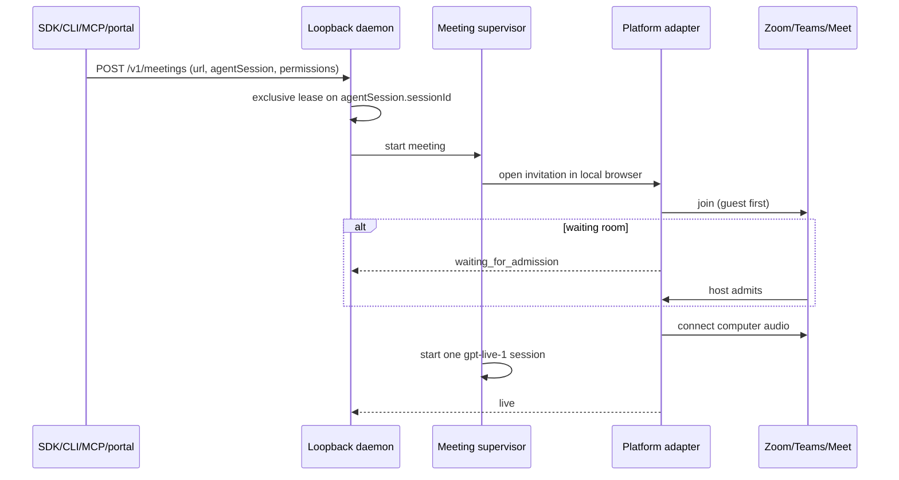
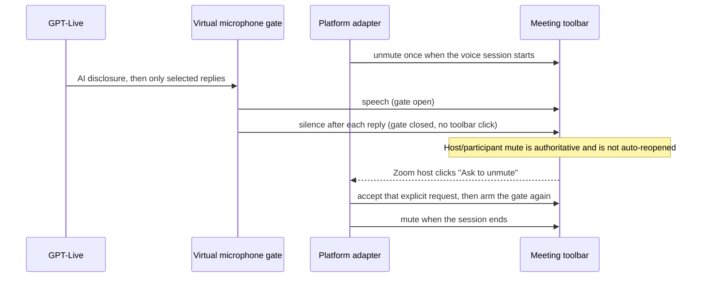
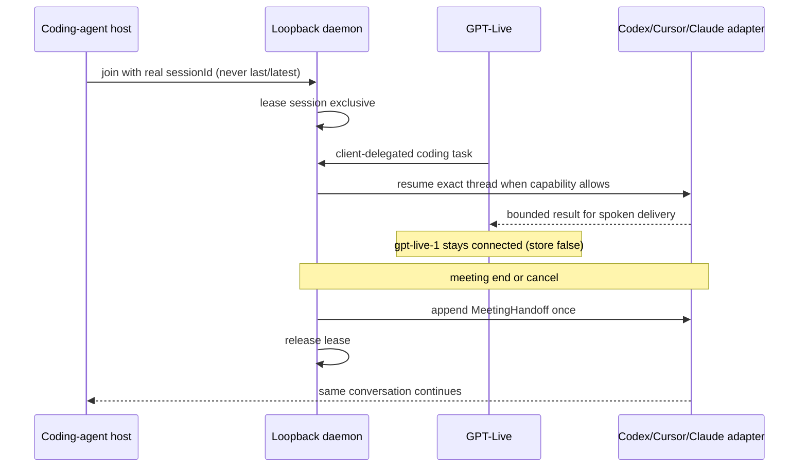
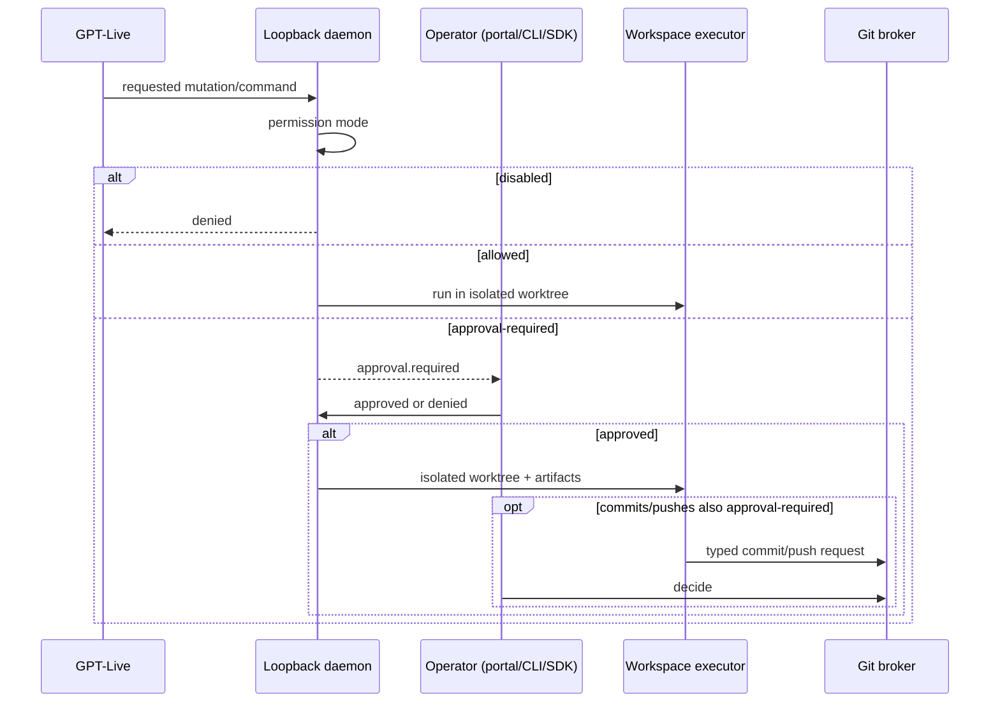
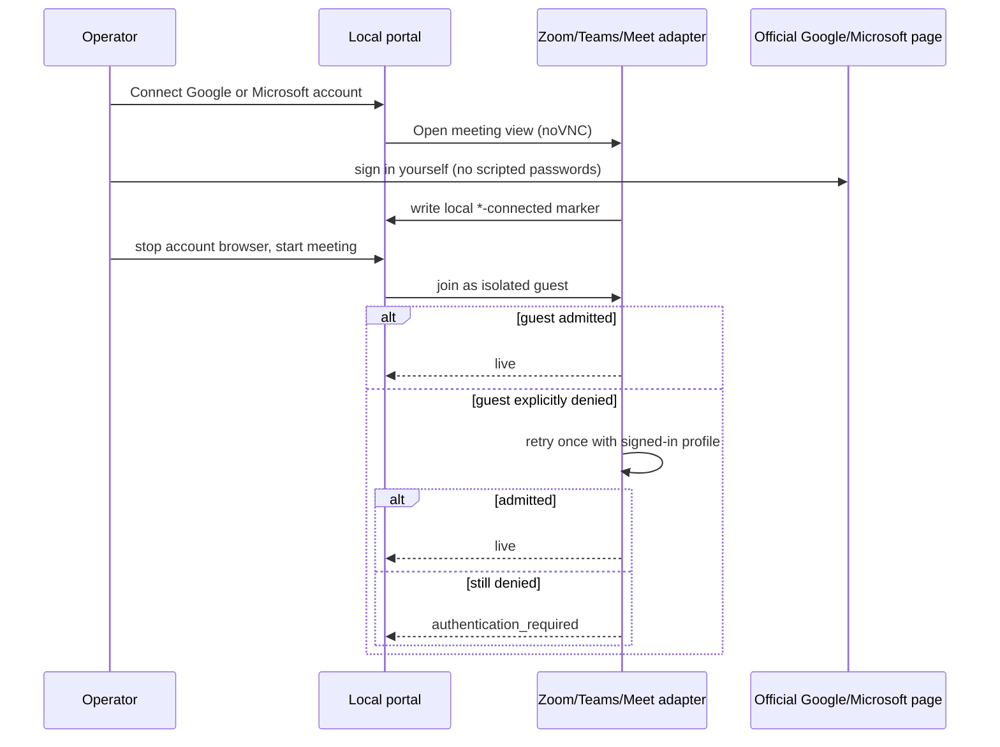

# Architecture

Colleague AI is a **local-first** meeting runtime. The loopback daemon on `127.0.0.1` is the supported production path. GPT-Live provides cloud voice. Coding-agent CLIs, browser profiles, workspace bytes, transcripts, and credentials stay on this computer.

See [capabilities](capabilities.md) for truthful platform and provider matrices. See [hosted runtime](hosted-runtime.md) for the foundation control plane (not production hosting).

## Runtime pieces

```text
Host integrations (Codex / Cursor / Claude MCP or CLI)
        │  real sessionId for exact continuity
        ▼
SDK / CLI / MCP  ──►  loopback daemon 127.0.0.1:8765
        │                    │
        │                    ├─ leases originating coding-agent session
        │                    ├─ approvals, artifacts, git broker
        │                    └─ starts meeting supervisor
        ▼
Local portal 127.0.0.1:8095  (context continuity: local-portal)
        │
        ▼
Docker meeting-agent  ← browser + PulseAudio + virtual camera
        │
        ▼
Zoom / Teams / Meet web client     GPT-Live (one gpt-live-1 session)
```

The meeting browser, virtual display, and audio bridge run in Docker (`compose.meeting.yaml`, service `meeting-agent`). Coding-agent workers run on the host so official CLI logins are not copied into the container.

## Join and admission



Portal joins always use `sessionId: local-portal` and `continuity: context`. Exact continuity is only for host integrations that pass the real originating thread id.

## Selective speech (platform microphone and virtual gate)



The platform microphone is unmuted once when the voice session starts and muted when it ends. Between replies only the local virtual gate closes, so participants hear silence while the platform shows Colleague AI as unmuted. If a host or participant mutes it, generated audio is discarded and the runtime never reopens the microphone on its own. If the host disables "Allow participants to unmute themselves" in Zoom, the start-of-session unmute fails and Colleague AI cannot speak until the host asks it to unmute; the Zoom adapter accepts the host's "The host would like you to unmute" dialog, because that is the host's explicit request.

Once the microphone can carry speech, the session speaks one short AI disclosure naming the person it acts for ("Hi, I'm an AI assistant joining on behalf of NAME. I'll mostly listen; say 'Colleague' if you need me."), then returns to listening. The name comes from the runtime state (`onBehalfOf`, or the call task "Take part in this meeting on behalf of NAME."), then `COLLEAGUE_OWNER_NAME`, then "the person who invited me". `COLLEAGUE_MEETING_INTRO=0` turns it off.

GPT-Live owns pauses, backchannels, and interruptions. The local runtime does not classify meeting speech or add a silence delay.

## Exact-session delegation and final handoff



Context continuity (`continuity: context`, `sessionId: local-portal`) does not resume an originating thread. Cursor and Claude Code exact resume run only when the installed CLI help documents a resume flag.

## Approval-gated workspace action



Mutations, tests, commits, and pushes never go through the Cursor or Claude CLIs. They stay on the generic approval plane, workspace executor, and git broker.

## Guest-then-signed-in fallback



Disconnect removes the local profile directory. It does not revoke sessions on other devices. Zoom has no signed-in profile fallback.

## Incoming shared-content change detection

When screen share is enabled, the meeting container screenshots the share surface every `captureIntervalMs`. Only settled, meaningfully changed frames reach the paid vision analyzer:

```text
meeting container (each capture)
  inbox still holds a frame        -> skip (backpressure)
  same bytes as previous capture   -> reuse its signature, no decode
  tile signature                   -> ~64x36 tiles (rows follow the aspect ratio); per tile the
                                      mean luminance and mean horizontal/vertical gradient over
                                      at most 6x6 sampled pixels
  settle                           -> must match the previous capture for settleTicks captures
  mask                             -> tiles that changed in 4 of the last 6 local comparisons
                                      (clock, video, webcam thumbnail, caret) are ignored until
                                      they stay quiet for about 3 captures
  changed vs last selected frame   -> write to inbox with the masked tile list
host daemon (each inbox frame)
  duplicate bytes / unchanged / oversized -> skip, as before
  matches one of the last 32 analyzed screens of this meeting
                                   -> re-emit that observation with reused: true; no analyzer
                                      call and no new screenshot or observation artifact
  otherwise                        -> store screenshot, analyze, store observation, remember it
container -> GPT-Live session.thinking.append ("Shared content: ...")
```

A tile counts as changed when its luminance or either gradient moves by more than 8 of 255. The change score is the square root of the changed-tile fraction, roughly the side of the changed area relative to the frame side.

| Setting | Default | Meaning |
| --- | --- | --- |
| `captureIntervalMs` | 4000 | Capture period, 2000-15000 ms. |
| `minChange` | 0.08 | Minimum change score. 0.08 is about 15 of 2304 tiles: a new slide bullet or a two-line scroll passes; a mouse pointer (1-4 tiles) or a hover highlight does not. |
| `settleTicks` | 1 | Consecutive near-identical captures needed before selection, 0-5. 0 selects the first changed capture, including mid-transition frames. |

Cost for a 1920x1080 frame in the meeting container: about 70 ms when the bytes changed (26 ms PNG decode through Pillow when importable, 45 ms tile sampling) and a SHA-256 otherwise. The host daemon decodes in pure Python (about 0.2 s for a slide, 0.8-0.9 s for dense code) and only for selected frames. Both sides compute signatures in a worker thread.

Content that keeps changing over more than half the frame, such as full-screen video, never settles and is not analyzed until it stops.

## Retention and deletion

All of these paths are gitignored. Stop the meeting or daemon before deleting files in use.

| Data | Location | How to delete |
| --- | --- | --- |
| Transcripts and call traces | `meeting-runtime/recordings/` | Delete the meeting directory from the portal history or remove the folder |
| Uploaded/pasted context | `meeting-runtime/context/index.json` | Portal **Clear saved context**, or delete the file |
| Browser profiles (Teams/Google) | `meeting-runtime/profiles/` | Portal **Disconnect**, which removes the local profile; or delete the directory |
| Coding-agent job files | `meeting-runtime/jobs/` (Codex at root; Cursor/Claude under `jobs/cursor`, `jobs/claude-code`) | Delete after workers are stopped; do not remove an active `worker.lock` to steal a session |
| Default empty workspace | `meeting-runtime/codex-workspace/` | Delete contents; the launcher recreates the directory |
| Daemon auth token | `.colleague/daemon.auth` | Stop the daemon; deleting the file forces a new token on next start |
| Daemon meetings, events, leases | `.colleague/daemon-data/` | Stop the daemon, then delete the directory |
| Artifacts (plans, patches, screenshots, observations) | `.colleague/daemon-data/.colleague/artifacts/` | Delete the meeting subdirectory, or the artifacts tree |
| Hosted pairing hashes | `.colleague/daemon-data/hosted/runner-state.json` | Portal/CLI/SDK **Unpair**, or delete the file after stopping the daemon |
| CLI last meeting id | `.colleague/cli-meeting.json` | Delete the file |
| Portal active meeting | `.colleague/portal-active.json` | Stop the colleague from the portal |
| API keys / meeting invite | `.env`, `.env.meeting` | Edit or delete; never commit |

Screenshots from incoming shared-content capture are stored as artifacts (`kind: screenshot` / `observation`), not as a separate public dump. Pairing codes and `deviceEnrollment` are shown once and are not written to these files.

### Container user and file permissions

The daemon writes each meeting's state under `meeting-runtime/run/` and `meeting-runtime/context/` as private files (directories 0700, files 0600). The meeting container reads them, writes `jobs/`, `recordings/`, and `profiles/`, and the host reads those back. So `compose.meeting.yaml` runs the container as the host user, `user: "${COLLEAGUE_UID:-1000}:${COLLEAGUE_GID:-1000}"`, and nothing on the host is made group- or world-readable. The daemon (`meeting_supervisor.host_user_env`) and `start-meeting-agent.sh` set both values to your `id -u` and `id -g`. Inside the container `HOME` is `/tmp` and the image points Playwright at its bundled browsers, so the uid needs no account in the image.

Before starting the container, the daemon creates `jobs/`, `recordings/`, and `profiles/` as 0700 directories, because Docker would create missing ones as root. If an earlier run left them owned by root or by uid 1001 (the image's `app` user), run `sudo chown -R "$(id -u):$(id -g)" meeting-runtime/jobs meeting-runtime/recordings meeting-runtime/profiles`.

With rootless Docker or Podman, container root is your user: export `COLLEAGUE_UID=0 COLLEAGUE_GID=0` before starting the daemon or `start-meeting-agent.sh`; values already in the environment are kept.

Restarting the meeting participant starts a **new** GPT-Live voice context even when a coding-agent session can be resumed.
