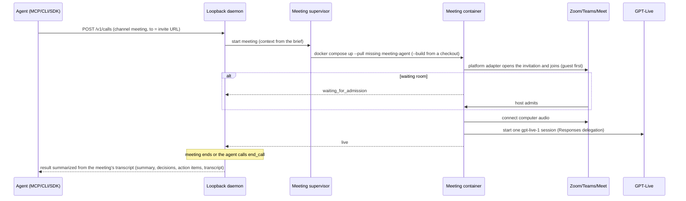
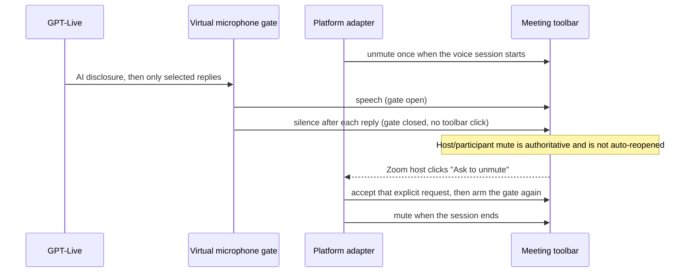
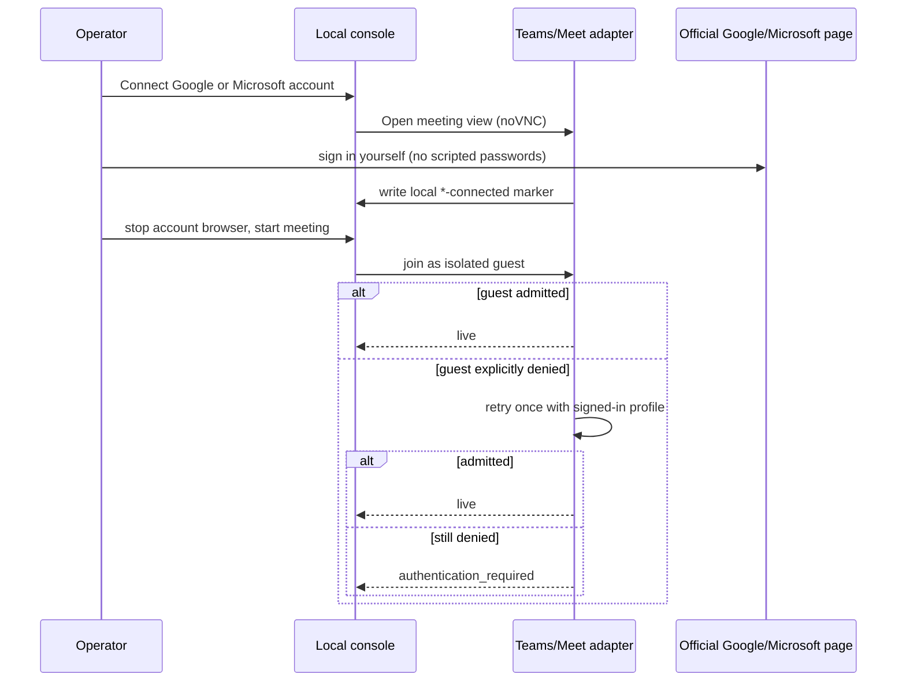

# Architecture

Smitline is a **local-first** runtime that gives any agent phone calls and meetings. The loopback daemon on `127.0.0.1` is the supported path. OpenAI GPT-Live (`gpt-live-1`) is the only voice: it does all listening and speaking. Browser profiles, transcripts, call records, and credentials stay on this computer.

See [capabilities](capabilities.md) for the meeting platform matrix, [calls](calls.md) for the brief and result, and [phone calls](phone.md) for how a phone call runs.

## Runtime pieces

```text
Your agent (Claude Code, Codex, Cursor, ChatGPT, your own code, ...)
        │
        ▼
MCP (127.0.0.1:8095/mcp or stdio) / remote connector / CLI / SDKs / REST
        │  brief in, result out
        ▼
smitline container (ghcr.io/kaelorlabs/smitline, host networking, data volume at /data)
Loopback daemon 127.0.0.1:8765
  ├─ calls API        /v1/calls, /v1/voices, /v1/profile
  ├─ phone gateway    127.0.0.1:8766 ──► SignalWire or Twilio ◄──► phone
  │                                       (audio relayed to GPT-Live, or direct over SIP)
  └─ meetings         /v1/meetings ──► meeting container (Docker)
                                          browser + PulseAudio + Xvfb + virtual camera
                                          ◄──► Zoom / Teams / Meet web client
                                          ◄──► GPT-Live (one gpt-live-1 session)
        ▲
Local console 127.0.0.1:8095 (Meetings, Calls, and Account, local MCP endpoint)
```

A phone call and a meeting are both **calls**: an agent sends a brief to `/v1/calls` with channel `phone` or `meeting`, and reads the same kind of result. A meeting call starts an ordinary daemon meeting underneath. The console uses the small `/v1/meetings` API directly when you start a meeting by hand.

In both, GPT-Live hands questions that need careful reasoning or precise facts to a backend model through Responses delegation. The backend knows the brief and context. Phone calls use `SMITLINE_PHONE_BACKEND_MODEL` and `SMITLINE_PHONE_WEB_SEARCH`; meetings use `SMITLINE_MEETING_BACKEND_MODEL` and `SMITLINE_MEETING_WEB_SEARCH`. Both models default to `gpt-5.6-terra`, and web search is off unless set to `1`.

### The Smitline container

Users run one image, `ghcr.io/kaelorlabs/smitline` (`Dockerfile`, about 600 MB): Python with the daemon, Node with the console, CLI, and MCP server, the Docker CLI with Compose, and `cloudflared` for the phone tunnel. `docker/entrypoint.sh` gives the data volume and the Docker socket to the image's `app` user (uid 1001) and starts `docker/start.sh`, which runs the daemon and the console; if either stops, the container stops and Docker's restart policy starts it again. The `smitline` command (`docker/smitline`) runs as the same user, so settings it writes stay readable to the service.

The image sets:

| Variable | Value | Meaning |
| --- | --- | --- |
| `SMITLINE_ROOT` | `/data` | `.env`, `.env.meeting`, and `.smitline/`. In a checkout, the checkout. |
| `SMITLINE_MEETING_DATA` | `/data/meetings` | Meeting `run/`, `recordings/`, `profiles/`, and `context/`. In a checkout, `meeting-runtime/`. |
| `SMITLINE_MANAGED` | `1` | The container runs the daemon: nothing else starts it, `smitline setup start` only reports, and `smitline setup register` prints how to connect agents instead of writing their config. |
| `SMITLINE_MEETING_IMAGE` | `ghcr.io/kaelorlabs/smitline-meeting:sha-…` | The meeting image from the same commit, pulled on the first meeting. |

`SMITLINE_VOLUME` (default `smitline`) names the data volume, and `SMITLINE_CONTAINER_NAME` (default `smitline`) the container, for the commands `setup register` prints.

Local agents connect to MCP over Streamable HTTP at `127.0.0.1:8095/mcp` with a bearer token kept in `.smitline/mcp.token`. The endpoint accepts only `Host: 127.0.0.1:8095` or `localhost:8095` and refuses any request with an `Origin` header, so a web page cannot reach it. Claude Desktop, which only starts stdio servers, runs `docker exec -i smitline smitline mcp`.

### The meeting container

One image, `ghcr.io/kaelorlabs/smitline-meeting` (`Dockerfile.meeting`, about 1.8 GB on disk): `python:3.12-slim-bookworm` with Playwright Chromium, PulseAudio, Xvfb, and x11vnc with noVNC for account sign-in, plus `meeting-runtime/` and the vendored `joinly/` subset. No speech models run in it. The daemon starts it through the host's Docker with `compose.meeting.image.yaml`, pulling it on the first meeting. It runs as uid 1001 and mounts the same `smitline` volume at `/data`; its `/meeting-runtime/run`, `recordings`, and `profiles` are links into `/data/meetings`.

From a checkout, the daemon uses `compose.meeting.yaml` instead: it builds `smitline-meeting:local` and mounts `meeting-runtime/` and `joinly/` read-only, so code changes need no rebuild.

`.github/workflows/images.yml` runs the tests on every pull request and push to `main` (including the runtime suite inside the meeting image and a start of the smitline image). A version tag such as `v0.1.0` also publishes both images, for `linux/amd64` and `linux/arm64`, tagged with the version, `latest`, and `sha-<commit>`; the smitline image starts the meeting image with the same `sha-` tag.

### Running from a checkout

`start-runtime-daemon.sh` runs the daemon on this computer's Python when it can create the daemon's venv (Python 3.10+ with `venv`), and otherwise in Docker (`Dockerfile.daemon`). `SMITLINE_DAEMON_RUNTIME=host` or `docker` picks one.

In Docker the container uses host networking, so the daemon and phone gateway listen on this computer's loopback exactly as they do without Docker. The checkout is mounted at the same path and the container runs as the host user, so `.smitline/`, `.env`, and call records stay the user's own files, and the meeting containers the daemon starts through the host's Docker socket see the same paths. The image holds only Python, aiohttp, the Docker CLI, and `cloudflared` for the phone tunnel; the code is mounted, so code changes need no rebuild, and the image is rebuilt only when `Dockerfile.daemon` or `requirements-daemon.txt` change. Settings exported in the shell reach the container by name, never by value on the command line. Docker Desktop needs host networking turned on for this computer to reach the daemon.

## Joining a meeting



The brief's context, questions, and limits become the meeting's starting context. The voice session and its backend read it when the session starts. When the meeting ends, the call reads the meeting's transcript from its local archive, and the summary model judges the objective from it and writes the result, as for a phone call. The local handoff is still built without a model call, and is the result only when nothing was said.

## Selective speech (platform microphone and virtual gate)



The platform microphone is unmuted once when the voice session starts and muted when it ends. Between replies only the local virtual gate closes, so participants hear silence while the platform shows Smitline as unmuted. If a host or participant mutes it, generated audio is discarded and the runtime never reopens the microphone on its own. If the host disables "Allow participants to unmute themselves" in Zoom, the start-of-session unmute fails and Smitline cannot speak until the host asks it to unmute; the Zoom adapter accepts the host's "The host would like you to unmute" dialog, because that is the host's explicit request.

Once the microphone can carry speech, the session speaks one short AI disclosure naming the person it acts for ("Hi everyone, I'm NAME's AI assistant. I'll mostly listen; say 'Smitline' if you need me."), then returns to listening. The name comes from the runtime state (`onBehalfOf`, or the call task "Take part in this meeting on behalf of NAME."), then `SMITLINE_OWNER_NAME`, then "the person who invited me". `SMITLINE_MEETING_INTRO=0` turns it off.

GPT-Live owns pauses, backchannels, and interruptions. The local runtime does not classify meeting speech or add a silence delay.

## Guest-then-signed-in fallback



Disconnect removes the local profile directory. It does not revoke sessions on other devices. Zoom has no signed-in profile fallback.

## Retention and deletion

In the image, the `.smitline/` and `.env` paths below are under `/data`, and the `meeting-runtime/` paths are under `/data/meetings`, all in the `smitline` volume: `docker volume rm smitline` deletes everything. In a checkout they are in the checkout, and gitignored. Stop the meeting or daemon before deleting files in use.

| Data | Location | How to delete |
| --- | --- | --- |
| Meeting transcripts and traces | `meeting-runtime/recordings/` | Remove the meeting's folder |
| Console reference context | `meeting-runtime/context/index.json` | Console **Clear saved context**, or delete the file |
| Browser profiles (Teams/Google) | `meeting-runtime/profiles/` | Console **Disconnect**, which removes the local profile; or delete the directory |
| Per-meeting runtime state | `meeting-runtime/run/` | Delete after the meeting has stopped |
| Daemon auth token | `.smitline/daemon.auth` | Stop the daemon; deleting the file forces a new token on next start |
| Daemon meetings, events, call records, webhook secret, API token digests | `.smitline/daemon-data/` | Stop the daemon, then delete the directory |
| Owner profile | `.smitline/profile.json` | `smitline profile`, or delete the file |
| Do-not-call list | `.smitline/do-not-call.json` | `smitline do-not-call remove <number>`, or delete the file |
| Contacts: names, notes, automatic context | `.smitline/contacts.json` | Console **Forget**, `smitline contacts forget <number>`, or delete the file |
| Remote connector grants (digests) | `.smitline/connector/` | `smitline connector revoke --all`, or delete the directory |
| Local MCP token | `.smitline/mcp.token` | Delete it; the next `smitline setup register` makes a new one, and agents need the new header |
| Console active meeting | `.smitline/portal-active.json` | Stop Smitline from the console |
| API keys / meeting invite | `.env`, `.env.meeting` | Edit or delete; never commit |

### Container user and file permissions

In the image, the smitline and meeting containers both run as uid 1001, so the private files they share need nothing more. The rest of this section is about running from a checkout.

The daemon writes each meeting's state under `meeting-runtime/run/` and `meeting-runtime/context/` as private files (directories 0700, files 0600). The meeting container reads them, writes `recordings/` and `profiles/`, and the host reads those back. So `compose.meeting.yaml` runs the container as the host user, `user: "${SMITLINE_UID:-1000}:${SMITLINE_GID:-1000}"`, and nothing on the host is made group- or world-readable. The daemon (`meeting_supervisor.host_user_env`) and `start-meeting-agent.sh` set both values to your `id -u` and `id -g`. Inside the container `HOME` is `/tmp` and the image points Playwright at its bundled browsers, so the uid needs no account in the image.

Before starting the container, the daemon creates `recordings/` and `profiles/` as 0700 directories, because Docker would create missing ones as root. If an earlier run left them owned by root or by uid 1001 (the image's `app` user), run `sudo chown -R "$(id -u):$(id -g)" meeting-runtime/recordings meeting-runtime/profiles`.

With rootless Docker or Podman, container root is your user: export `SMITLINE_UID=0 SMITLINE_GID=0` before starting the daemon or `start-meeting-agent.sh`; values already in the environment are kept.

Restarting the meeting participant starts a **new** GPT-Live voice session.
