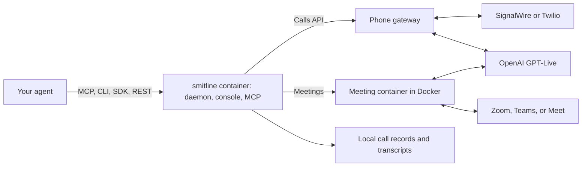

# Development

Read the [product vision, decisions, and progress ledger](product-vision-and-progress.md) before making substantial product or architecture changes. Contributors, human or agent, should start from [AGENTS.md](../AGENTS.md) for the doc index and invariants.

## How the pieces fit



Smitline runs as one container, `smitline`, which starts a second container for each meeting, `smitline-meeting-agent-1` from the `smitline-meeting` image: the meeting browser, virtual display, virtual camera, and audio bridge. GPT-Live keeps **one continuous `gpt-live-1` session** per call or meeting (`store: false`). OpenAI GPT-Live is the only voice: it does all the listening and speaking, and hands harder questions to a backend model that knows the brief. See [architecture](architecture.md) for sequence diagrams and [capabilities](capabilities.md) for the Zoom / Teams / Meet matrix.

## Surfaces

| Surface | Role |
| --- | --- |
| **Daemon** | In the `smitline` container (`./start-runtime-daemon.sh` from a checkout): loopback HTTP and SSE with bearer auth. Serves `/v1/calls`, `/v1/voices`, `/v1/profile`, `/v1/do-not-call`, `/v1/openapi.json`, and a small `/v1/meetings` API used by the console. |
| **Calls API** | `/v1/calls`: any agent sends a brief (phone number or meeting link, goal, context) and reads a structured result. See [calls](calls.md). |
| **Phone gateway** | `127.0.0.1:8766`: the only provider-facing routes, exposed through a quick tunnel or your proxy. See [phone calls](phone.md). |
| **Console** | Meetings and Calls tabs, and the local MCP endpoint `/mcp`, on `127.0.0.1:8095` (`./start-control-panel.sh` from a checkout). |
| **TypeScript SDK** | `smitline-sdk`: calls, profile, and voices. Not published to npm; use it from a checkout. |
| **Python SDK** | `smitline` (`from smitline import ...`): the same contract. Not published to PyPI; use it from a checkout. |
| **CLI** | `packages/cli`: `smitline call`, `calls`, `profile`, `do-not-call`, `voices`, `setup`, `mcp`, and `connector`. In the image: `docker exec smitline smitline ...`. |
| **MCP** | `packages/mcp`: the call tools over Streamable HTTP at `127.0.0.1:8095/mcp` with a local bearer token, or over stdio (`smitline mcp`; Claude Desktop runs `docker exec -i smitline smitline mcp`). |
| **Remote connector** | `./start-connector.sh`, from a checkout (the image does not run it yet): the same call tools over HTTPS with OAuth sign-in, so cloud agents such as ChatGPT and Claude can place calls and join meetings while the daemon stays on loopback. See [agents](agents.md). |

## Project layout

| Path | Responsibility |
| --- | --- |
| [`meeting-runtime/`](../meeting-runtime/) | Daemon, calls, phone line and gateway, meeting adapters and bridge, transcripts, tests |
| [`control-panel/`](../control-panel/) | Local console |
| [`packages/sdk-typescript/`](../packages/sdk-typescript/) · [`packages/sdk-python/`](../packages/sdk-python/) | SDKs |
| [`packages/cli/`](../packages/cli/) · [`packages/mcp/`](../packages/mcp/) | CLI, MCP server, and remote connector |
| [`joinly/`](../joinly/) | Vendored subset of Joinly: browser session, virtual devices, camera feed, Teams and Meet controllers |
| `Dockerfile`, `docker/` | The `smitline` image: daemon, console, CLI, and MCP, with Node and Python inside |
| `Dockerfile.meeting`, `compose.meeting.image.yaml` | The meeting image, and how the `smitline` container starts it |
| `compose.meeting.yaml`, `Dockerfile.daemon`, `start-*.sh` | Running from a checkout |
| `.github/workflows/images.yml` | Tests every pull request and push to `main`; a version tag (`git tag v0.1.2 && git push origin v0.1.2`) publishes both images to GHCR |

## Run from a checkout

Contributors can run everything from a clone instead of the published images. That needs Node.js 22 and Docker; settings then live in `.env` and `.smitline/` in the checkout:

```bash
git clone https://github.com/kaelorlabs/smitline.git ~/smitline
cd ~/smitline && npm install
node packages/cli/src/smitline.mjs setup start      # the daemon, in Docker or on Python 3.10+
node packages/cli/src/smitline.mjs setup stop       # stop it (and the phone tunnel); refuses mid-call without --force
./start-control-panel.sh                             # the console and MCP endpoint
```

`smitline setup register` then writes the MCP server into Claude Code, Codex, and Cursor directly. To try the images locally, build them with `docker build -f Dockerfile.meeting -t smitline-meeting:local .` and `docker build --build-arg MEETING_IMAGE=smitline-meeting:local -t smitline:local .`.

## Tests

The runtime tests run in the meeting image:

```bash
docker compose -f compose.meeting.yaml build meeting-agent
docker run --rm \
  --entrypoint /app/.venv/bin/python \
  -v "$PWD/meeting-runtime:/meeting-runtime:ro" \
  -v "$PWD/joinly:/opt/joinly:ro" \
  smitline-meeting:local \
  -m unittest discover -s /meeting-runtime -p 'test_*.py'

npm test
cd packages/sdk-python && python3 -m unittest discover -s tests
```

Unit tests do not establish live admission, audio quality, or phone behavior. Test those with a real call or meeting after changing browser, audio, or phone code.

## README images

The screenshots in `docs/images/` come from a demo console filled with fictional calls (555 numbers, made-up businesses), never from real call records. Re-take them the same way when the console changes.
