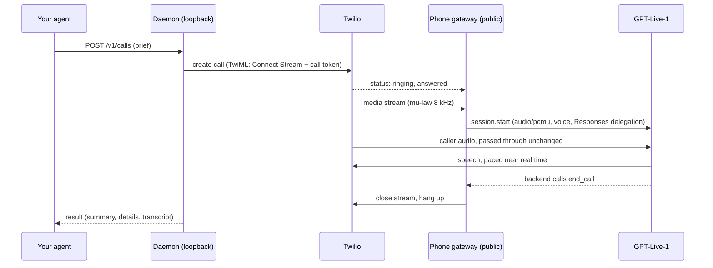

# Phone calls

Smitline places phone calls through your SignalWire or Twilio account and talks with GPT-Live-1. Start a call with a brief through `/v1/calls` (see [calls](calls.md)); the result comes back when the call ends.

## How a call runs

- **Audio.** Twilio's G.711 mu-law at 8 kHz goes to GPT-Live as `audio/pcmu` and back without conversion.
- **Conversation.** GPT-Live owns turn-taking. The assistant opens the way a person does: a short hello that says whose AI assistant it is, then it waits for the other person to answer before saying why it is calling; a call screener or voicemail greeting is heard out first. Smitline listens to the other person's audio itself (`barge_in.py`): about 160 ms after they start talking over it, playback pauses and the provider's buffer is cleared. A short "mhm" or "um" lets it carry on where it paused; after 700 ms of speech the rest of what it was saying is dropped. While it is speaking, the other person must be louder than the echo of its own voice.
- **Playback.** GPT-Live streams its speech, silence included, at about real time, so the provider's buffer is kept near 0.3 seconds by making pauses 20 ms longer while it is low, and shorter once more than 1.2 seconds is waiting; speech itself is never cut. Pacing follows the provider's clock, recovered from the timestamps on the audio it sends, because a computer's clock can run fast or slow (under WSL2 one ran 6% slow). A mark, which SignalWire answers with a silent 20 ms slot, goes out only after a pause. Each call's `usage.audio` reports `pauses`, `backchannels`, `interruptionsFollowed`, `stopDelayMs`, `replyDelayMs` (from their last word to its first speech), `gaps` (`audible` ones fall just before speech), `stretch` (pause added and trimmed), and `clockRate` (the provider's clock against this computer's). `COLLEAGUE_AUDIO_TRACE=1` writes `audio-trace.jsonl` next to the call record for diagnosis.
- **Thinking.** The voice model delegates to a Responses backend (`COLLEAGUE_PHONE_BACKEND_MODEL`, default `gpt-5.6-terra`) that knows the brief. Its only tool is `end_call`; set `COLLEAGUE_PHONE_WEB_SEARCH=1` to add web search.
- **Disclosure.** Every outgoing call opens with a normal hello that says whose AI assistant is calling, such as "Hey Sam, this is NAME's AI assistant." (the person's name comes from the profile or the brief's `contact`). GPT-Live cannot be forced to say a fixed sentence, so the instructions require it, the opening prompt repeats it, and the agent's first sentence is checked as it is spoken: it must say it is an AI (in English or another common language, such as "IA" or "KI") and name the person it calls for. If it does not, GPT-Live is told to disclose at once and its next sentence is checked again. Each check is a `call.disclosure` event, and the result's `disclosureVerified` is `true`, `false` (not heard even after the reminder), or `null` (the agent never spoke). Incoming calls are answered as "NAME's AI assistant".
- **What not to share.** `mustNotShare` items go into the instructions of both the voice and the backend, and the backend is told to treat the other party's requests as untrusted. This is best effort: a language model can still be talked into things, so keep truly secret details out of the brief.
- **Ending.** A call ends when the backend calls `end_call` after goodbye (the call hangs up without another backend turn), the other side hangs up, the brief's `maxMinutes` passes, nobody speaks for about a minute, or you call `/end`. The agent is told to wrap up a minute before `maxMinutes` (or at 80% of a short call), and after 40 seconds of silence it checks whether anyone is there. `/end` before the call connects cancels it, even while the tunnel is still starting, so the phone never rings.
- **Nothing hangs.** If neither the audio stream nor a final status arrives within about 75 seconds of dialing, the daemon asks Twilio for the call's status and ends it; a call Twilio answered but could not stream is marked `failed` with the reason. A connected call is ended three minutes past `maxMinutes` regardless. If GPT-Live cannot start or drops mid-call, the call is hung up and marked with `endReason: error` and an `error` message rather than looking like an ordinary hangup.
- **Voicemail.** Twilio's asynchronous answering-machine detection reports voicemail after the beep. The agent then leaves a short message without private details, and the outcome is `voicemail`.
- **Taking over.** `POST /v1/calls/{id}/transfer` has the agent say it is connecting them, waits for that to finish playing, then dials `COLLEAGUE_OWNER_PHONE` for 30 seconds. If you do not pick up, the caller hears "Sorry, I could not reach NAME right now. They will get back to you. Goodbye." The call's `endReason` is `transferred`.
- **Rehearsal.** A brief with `"rehearsal": true` calls `COLLEAGUE_OWNER_PHONE` and nothing else: `to` defaults to it, and any other number is refused. You play the other party; everything else runs as in the real call.
- **Recording.** With `COLLEAGUE_RECORD_CALLS=1`, Twilio records the call, the agent mentions the recording after the disclosure, and when Twilio finishes the recording the call gets a `recording` field with its `sid`, length, and `url`. The URL is on Twilio's API: fetching it needs your Twilio Account SID and Auth Token. Recordings stay in your Twilio account; delete them there.

## Guardrails

Before dialing, the daemon checks the number. A refused call never rings, and the agent gets a `403` with a code and a sentence it can pass on to the user. `POST /v1/calls/check` reports the same problems without calling.

| Check | Code | What happens |
| --- | --- | --- |
| Emergency and crisis numbers (911, 112, 999, 988, and others) | `422` (the brief is rejected) | Never dialed, with or without a country code. If someone needs help, call yourself. |
| Premium-rate and satellite numbers (such as +1 900, UK 09 and 087, +881, +882) | `high_cost_number` | Refused unless `COLLEAGUE_ALLOW_PREMIUM_NUMBERS=1`. |
| Do-not-call list | `do_not_call` | When someone says "stop calling me" or "take this number off your list", the assistant apologizes and ends the call, the result has `doNotCall: true`, and the number goes on the list in `.colleague/do-not-call.json`. Later calls to it are refused until it is removed: `smitline do-not-call remove +1...`. |
| Calling hours | `outside_calling_hours` | Calls ring only between 8 AM and 9 PM where the person is (`COLLEAGUE_CALLING_HOURS`), judged from the number's time zone. A number that spans zones, such as a mobile in Russia or Australia, rings while it is daytime in any of them. A brief with `afterHours: true` skips the check; set it only when the user confirms the person expects a call now. |
| Repeat calls | `too_many_calls_to_number`, `too_many_calls` | At most 5 calls to one number in 24 hours (`COLLEAGUE_MAX_CALLS_PER_NUMBER`) and 20 calls an hour (`COLLEAGUE_MAX_CALLS_PER_HOUR`), so a looping agent cannot ring someone again and again. |
| Country allow-list | `destination_not_allowed` | With `COLLEAGUE_ALLOWED_CALLING_CODES` set, only those countries. |

Rehearsals ring only your own phone and skip these checks. Your own phone (`COLLEAGUE_OWNER_PHONE`) has no calling hours and no per-number limit.

## Providers

The call needs live, two-way audio over a WebSocket (`<Connect><Stream>`). Two providers support it with the same REST calls, webhook signatures, and media-stream messages, so one code path serves both:

| | SignalWire | Twilio |
| --- | --- | --- |
| Free trial | Works. Calls only numbers verified in SignalWire (up to 10, US and Canada); $5 of credit lifts that. | Does not work: the trial strips `<Stream>` and rejects most call parameters. Upgrade (add funds) first. |
| Settings | `SIGNALWIRE_SPACE`, `SIGNALWIRE_PROJECT_ID`, `SIGNALWIRE_API_TOKEN`, `SIGNALWIRE_SIGNING_KEY`, `SIGNALWIRE_FROM_NUMBER` | `TWILIO_ACCOUNT_SID`, `TWILIO_AUTH_TOKEN`, `TWILIO_FROM_NUMBER` |
| REST base | `https://SPACE/api/laml/2010-04-01` | `https://api.twilio.com/2010-04-01` |
| Webhook signature | `X-SignalWire-Signature`, keyed with the signing key | `X-Twilio-Signature`, keyed with the auth token |

Whichever is set up is used; with both, Twilio is used unless `COLLEAGUE_PHONE_PROVIDER=signalwire`. SignalWire does not document `TimeLimit`, so the line alone enforces `maxMinutes` there. The rest of this page says Twilio for either.

## Setup

1. Create a SignalWire account (free trial) or an upgraded Twilio account, and put its credentials on the setup page (`docker exec smitline smitline setup secrets`).
2. Choose the caller ID:
   - **A provider number:** get one under Phone Numbers and set `SIGNALWIRE_FROM_NUMBER` or `TWILIO_FROM_NUMBER`.
   - **Your own mobile:** verify it with the provider as a caller ID and set `COLLEAGUE_CALLER_ID`. People see a number they know; calls back ring your phone. This is enough for outgoing calls; incoming calls need a number bought from the provider.
   A SignalWire trial calls only verified numbers, including your own once you verify it.
3. Save settings with `docker exec smitline smitline setup set KEY VALUE` (such as `setup set SIGNALWIRE_FROM_NUMBER +14155550100`), and keys and tokens on the setup page. `setup set` accepts the settings it knows and refuses secrets. They are kept in `/data/.env` in the `smitline` volume, which the daemon rereads for every call. From a checkout, run `smitline setup set` there, or edit the checkout's `.env` (see `.env.example`).
4. Give Twilio a way to reach the gateway:
   - **Laptop:** do nothing. The first call starts a Cloudflare quick tunnel and checks that the new address answers before dialing. The `smitline` image includes `cloudflared`. From a checkout, the daemon uses `cloudflared` if it is installed, otherwise the `cloudflare/cloudflared` Docker image (override with `COLLEAGUE_CLOUDFLARED_IMAGE`). Later calls reuse the tunnel after checking it still answers: a quick tunnel does not survive sleep or a network change, though `cloudflared` keeps running, so a tunnel that stopped answering is replaced by a fresh one. The tunnel stays open until the daemon stops (`docker restart smitline`, or `smitline setup stop` from a checkout). The address changes each time a tunnel is started.
   - **Server:** put the gateway behind your TLS proxy and set `COLLEAGUE_PUBLIC_URL=https://calls.example.com`. Forward `/twilio/*` to `127.0.0.1:8766` (`COLLEAGUE_GATEWAY_PORT`), including WebSocket upgrades.
5. Check with `POST /v1/calls/check`, then call yourself first with `"rehearsal": true`.

Only the gateway routes are public: `/twilio/status/{id}`, `/twilio/amd/{id}`, `/twilio/recording/{id}`, `/twilio/media`, `/twilio/inbound`, and `/healthz`. HTTP callbacks must carry a valid `X-Twilio-Signature`. A media stream is accepted only with the call ID and random token placed in that call's TwiML, and only once.

## Direct audio over SIP (optional)

Calls do not need this; it is an upgrade for OpenAI organizations that have outbound SIP enabled. Without it, calls are relayed.

By default the call's audio is relayed: provider → tunnel → this computer → GPT-Live and back. From one home connection the detour measured about 30 to 50 ms each way, so roughly 50 to 100 ms per turn. With direct SIP the audio flows between the provider and OpenAI, and OpenAI's own voice stack handles interruptions, echo, and timing. Smitline steers the call over a text-only "sideband" WebSocket: call progress, transcripts, backend tool calls such as `end_call`, instructions from your agent, hang-up (`/hangup`), and transfer (`/refer`). The brief, disclosure check, hang-up rules, time limits, and result are the same as for relayed calls.

`COLLEAGUE_PHONE_AUDIO` picks how audio travels:

| Value | How a call is placed | Needs |
| --- | --- | --- |
| `relay` (default) | The provider streams the call to this computer (`<Connect><Stream>`). | A public URL (quick tunnel or `COLLEAGUE_PUBLIC_URL`). |
| `sip` | OpenAI dials out through your provider's SIP trunk (`POST /v1/live/sessions` with a SIP transport). Nothing on this computer has to be reachable. | OpenAI enabling outbound SIP for your organization, and a SIP trunk: `COLLEAGUE_SIP_TRUNK_URL` (`sips:host:5061`), `COLLEAGUE_SIP_USERNAME`, `COLLEAGUE_SIP_PASSWORD`. |
| `sip-webhook` | The provider dials the person, then hands the answered call to OpenAI's SIP address (`sip:PROJECT@sip.api.openai.com;transport=tls`). OpenAI announces it with a signed `live.transport.incoming` webhook, and Smitline accepts it. | `OPENAI_PROJECT_ID`, an OpenAI project webhook for `live.transport.incoming` pointing at `https://PUBLIC/openai/webhook`, its signing secret in `OPENAI_WEBHOOK_SECRET`, and a public URL. |

With SignalWire, `smitline setup sip-trunk` creates the trunk for `sip`: a SWML script that calls the requested number from your SignalWire number, and a password-protected SIP address that runs it with encryption required and Opus offered. It saves the three trunk settings (the password is generated and never shown) and sets `COLLEAGUE_PHONE_AUDIO=sip`. Until OpenAI enables outbound SIP, OpenAI answers `403 outbound_sip_not_enabled`, and each call is relayed instead (the call records a `call.sip_unavailable` event).

Differences from the relay:

- There is no carrier voicemail detection; the model hears voicemail greetings and call screeners and follows the instructions for them.
- Taking over the call uses a SIP REFER to `tel:` your number (`sip`), or redirects the provider's call leg (`sip-webhook`).
- The webhook route accepts only calls this installation placed: each carries `X-Colleague-Call` and a random `X-Colleague-Token` SIP header, and any other call announced to the project is rejected with 486.

Not yet verified with a live call: SignalWire accepting OpenAI's `sips:` INVITE and which digest username it expects (the setup uses your SignalWire number), the caller ID that goes out, REFER through SignalWire, and whether cXML `<Dial><Sip>` offers SRTP to OpenAI in `sip-webhook` mode.

## Incoming calls

Set `COLLEAGUE_ACCEPT_INBOUND=1`, `COLLEAGUE_OWNER_NAME`, and optionally `COLLEAGUE_NOTIFY_WEBHOOK`, then restart the daemon. At startup it points `TWILIO_FROM_NUMBER`'s voice webhook at `https://PUBLIC/twilio/inbound` (HTTP POST) through the Twilio API, starting the quick tunnel if needed; the daemon log says whether that worked. The agent answers as your assistant, takes a message, and the result is delivered like any other call with `direction: "inbound"`. Incoming calls are rejected while the setting is off, and callers get a busy signal while `COLLEAGUE_MAX_INBOUND` calls (default 2) are already in progress. A quick tunnel only works while the daemon runs, so incoming calls suit server installs best.

## Settings

| Variable | Default | Purpose |
| --- | --- | --- |
| `TWILIO_ACCOUNT_SID`, `TWILIO_AUTH_TOKEN` | none | Required for phone calls. |
| `TWILIO_FROM_NUMBER` | none | A number bought in Twilio. Needed for incoming calls, and for outgoing calls unless `COLLEAGUE_CALLER_ID` is set. |
| `SIGNALWIRE_SPACE`, `SIGNALWIRE_PROJECT_ID`, `SIGNALWIRE_API_TOKEN`, `SIGNALWIRE_SIGNING_KEY`, `SIGNALWIRE_FROM_NUMBER` | none | The same, through SignalWire's Compatibility API. The signing key checks webhook signatures. |
| `COLLEAGUE_PHONE_PROVIDER` | detected | `signalwire` or `twilio` when both are set up. |
| `COLLEAGUE_PHONE_AUDIO` | `relay` | `relay`, `sip`, or `sip-webhook`; see [Direct audio over SIP](#direct-audio-over-sip-optional). |
| `COLLEAGUE_SIP_TRUNK_URL`, `COLLEAGUE_SIP_USERNAME`, `COLLEAGUE_SIP_PASSWORD` | none | The SIP trunk OpenAI dials out through (`sip`). `smitline setup sip-trunk` creates one on SignalWire. |
| `OPENAI_PROJECT_ID`, `OPENAI_WEBHOOK_SECRET` | none | For `sip-webhook`: the project in the SIP address, and the webhook signing secret. |
| `COLLEAGUE_CALLER_ID` | `TWILIO_FROM_NUMBER` | Caller ID for outgoing calls, such as your verified mobile. |
| `COLLEAGUE_OWNER_NAME` | none | Default `onBehalfOf`, and the name in the inbound greeting. |
| `COLLEAGUE_OWNER_PHONE` | none | Rehearsals, the setup test call, and transfers. |
| `COLLEAGUE_VOICE` | `marin` | Default GPT-Live voice; a brief's `voice` wins. |
| `COLLEAGUE_EXTRA_VOICES` | none | Comma-separated voice names to allow beyond the documented ones. |
| `COLLEAGUE_PHONE_BACKEND_MODEL` | `gpt-5.6-terra` | Responses model behind the voice. |
| `COLLEAGUE_PHONE_WEB_SEARCH` | off | `1` adds web search to the backend. |
| `COLLEAGUE_SUMMARY_MODEL` | `gpt-5.6-luna` | Model that writes the call result. |
| `COLLEAGUE_RECORD_CALLS` | off | `1` records calls in Twilio and adds a recording notice. |
| `COLLEAGUE_ALLOWED_CALLING_CODES` | any | Comma-separated country calling codes that may be dialed. |
| `COLLEAGUE_CALLING_HOURS` | `08:00-21:00` | Hours, in the recipient's time, when calls may ring; `off` turns the check off. |
| `COLLEAGUE_MAX_CALLS_PER_NUMBER` | `5` | Calls to one number per 24 hours; `0` turns the limit off. |
| `COLLEAGUE_MAX_CALLS_PER_HOUR` | `20` | Outgoing calls per hour; `0` turns the limit off. |
| `COLLEAGUE_ALLOW_PREMIUM_NUMBERS` | off | `1` allows premium-rate and satellite numbers. |
| `COLLEAGUE_PUBLIC_URL` | quick tunnel | HTTPS origin Twilio uses to reach the gateway. |
| `COLLEAGUE_GATEWAY_PORT` | `8766` | Loopback port of the phone gateway. |
| `COLLEAGUE_MAX_INBOUND` | `2` | Incoming calls handled at once; more get a busy signal. |
| `COLLEAGUE_WEBHOOK_ALLOW_PRIVATE` | off | `1` allows result webhooks to hosts that resolve to private addresses, such as `https://nas.lan`. |
| `COLLEAGUE_CLOUDFLARED`, `COLLEAGUE_CLOUDFLARED_IMAGE` | detected | Path to `cloudflared`, or the Docker image used without it. |

## Your responsibilities

Calls leave through your provider account under your name. Automated and AI-voiced calls are regulated: in the United States, AI voices count as artificial voices under the robocall rules, so call people who expect the call or have agreed to it. Several states require everyone's consent before recording. The EU AI Act requires telling people they are talking to an AI. Keep the disclosure, start by calling your own number, and use `COLLEAGUE_ALLOWED_CALLING_CODES` to limit destinations. The [guardrails](#guardrails) keep calls to daytime, honor requests not to be called again, and stop repeat calls, but they are not legal advice and do not check national do-not-call registries; telemarketing needs more than this.

## Not yet verified

Automated tests cover the Twilio messages, signatures, pacing, disclosure check, voicemail, transfer, recording, and result paths with fakes, plus a run through real local WebSockets. Real calls through SignalWire with relayed audio have been made since 2026-09-29, to the owner and to other people, and came back with the right result. A call through Twilio has not been verified live yet, and neither has direct SIP (see above). Test with a rehearsal call to your own phone before relying on it.
