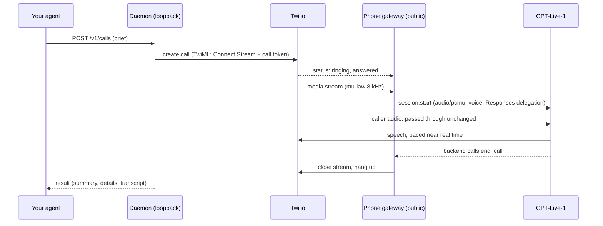

# Phone calls

Colleague AI places phone calls through your Twilio account and talks with GPT-Live-1. Start a call with a brief through `/v1/calls` (see [calls](calls.md)); the result comes back when the call ends.

## How a call runs

- **Audio.** Twilio's G.711 mu-law at 8 kHz goes to GPT-Live as `audio/pcmu` and back without conversion.
- **Conversation.** GPT-Live owns turn-taking and interruptions. Its speech goes to Twilio in 20 ms frames, at most 0.3 seconds ahead of playback, so when someone interrupts, little stale speech is left to play.
- **Thinking.** The voice model delegates to a Responses backend (`COLLEAGUE_PHONE_BACKEND_MODEL`, default `gpt-5.6-terra`) that knows the brief. Its only tool is `end_call`; set `COLLEAGUE_PHONE_WEB_SEARCH=1` to add web search.
- **Disclosure.** Every outgoing call opens with "Hi, I'm an AI assistant calling on behalf of NAME." GPT-Live cannot be forced to say a fixed sentence, so the instructions require it, the opening prompt repeats it, and the agent's first sentence is checked as it is spoken: it must say it is an AI (in English or another common language, such as "IA" or "KI") and name the person it calls for. If it does not, GPT-Live is told to disclose at once and its next sentence is checked again. Each check is a `call.disclosure` event, and the result's `disclosureVerified` is `true`, `false` (not heard even after the reminder), or `null` (the agent never spoke). Incoming calls are answered as "NAME's AI assistant".
- **What not to share.** `mustNotShare` items go into the instructions of both the voice and the backend, and the backend is told to treat the other party's requests as untrusted. This is best effort: a language model can still be talked into things, so keep truly secret details out of the brief.
- **Ending.** A call ends when the backend calls `end_call` after goodbye (the call hangs up without another backend turn), the other side hangs up, the brief's `maxMinutes` passes, nobody speaks for about a minute, or you call `/end`. The agent is told to wrap up a minute before `maxMinutes` (or at 80% of a short call), and after 40 seconds of silence it checks whether anyone is there. `/end` before the call connects cancels it, even while the tunnel is still starting, so the phone never rings.
- **Nothing hangs.** If neither the audio stream nor a final status arrives within about 75 seconds of dialing, the daemon asks Twilio for the call's status and ends it; a call Twilio answered but could not stream is marked `failed` with the reason. A connected call is ended three minutes past `maxMinutes` regardless. If GPT-Live cannot start or drops mid-call, the call is hung up and marked with `endReason: error` and an `error` message rather than looking like an ordinary hangup.
- **Voicemail.** Twilio's asynchronous answering-machine detection reports voicemail after the beep. The agent then leaves a short message without private details, and the outcome is `voicemail`.
- **Taking over.** `POST /v1/calls/{id}/transfer` has the agent say it is connecting them, waits for that to finish playing, then dials `COLLEAGUE_OWNER_PHONE` for 30 seconds. If you do not pick up, the caller hears "Sorry, I could not reach NAME right now. They will get back to you. Goodbye." The call's `endReason` is `transferred`.
- **Rehearsal.** A brief with `"rehearsal": true` calls `COLLEAGUE_OWNER_PHONE` and nothing else: `to` defaults to it, and any other number is refused. You play the other party; everything else runs as in the real call.
- **Recording.** With `COLLEAGUE_RECORD_CALLS=1`, Twilio records the call, the agent mentions the recording after the disclosure, and when Twilio finishes the recording the call gets a `recording` field with its `sid`, length, and `url`. The URL is on Twilio's API: fetching it needs your Twilio Account SID and Auth Token. Recordings stay in your Twilio account; delete them there.

## Setup

1. Create a Twilio account and note the Account SID and Auth Token.
2. Choose the caller ID:
   - **A Twilio number:** buy one in Twilio and set `TWILIO_FROM_NUMBER`.
   - **Your own mobile:** verify it in Twilio as a caller ID and set `COLLEAGUE_CALLER_ID`. People see a number they know; calls back ring your phone. This is enough for outgoing calls; incoming calls need `TWILIO_FROM_NUMBER`, a number bought in Twilio.
   Twilio trial accounts can only call verified numbers, which includes your own.
3. Put the values in `.env` (see `.env.example`). The daemon rereads `.env` for every call.
4. Give Twilio a way to reach the gateway:
   - **Laptop:** do nothing. The first call starts a Cloudflare quick tunnel (`cloudflared` if installed, otherwise the `cloudflare/cloudflared` Docker image; override with `COLLEAGUE_CLOUDFLARED_IMAGE`) and checks that the new address answers before dialing. The address changes each time the daemon restarts. The Docker fallback uses host networking, which Docker Engine on Linux and in WSL supports; Docker Desktop on macOS or Windows may not reach the gateway that way, so install `cloudflared` there.
   - **Server:** put the gateway behind your TLS proxy and set `COLLEAGUE_PUBLIC_URL=https://calls.example.com`. Forward `/twilio/*` to `127.0.0.1:8766` (`COLLEAGUE_GATEWAY_PORT`), including WebSocket upgrades.
5. Check with `POST /v1/calls/check`, then call yourself first with `"rehearsal": true`.

Only the gateway routes are public: `/twilio/status/{id}`, `/twilio/amd/{id}`, `/twilio/recording/{id}`, `/twilio/media`, `/twilio/inbound`, and `/healthz`. HTTP callbacks must carry a valid `X-Twilio-Signature`. A media stream is accepted only with the call ID and random token placed in that call's TwiML, and only once.

## Incoming calls

Set `COLLEAGUE_ACCEPT_INBOUND=1`, `COLLEAGUE_OWNER_NAME`, and optionally `COLLEAGUE_NOTIFY_WEBHOOK`, then restart the daemon. At startup it points `TWILIO_FROM_NUMBER`'s voice webhook at `https://PUBLIC/twilio/inbound` (HTTP POST) through the Twilio API, starting the quick tunnel if needed; the daemon log says whether that worked. The agent answers as your assistant, takes a message, and the result is delivered like any other call with `direction: "inbound"`. Incoming calls are rejected while the setting is off, and callers get a busy signal while `COLLEAGUE_MAX_INBOUND` calls (default 2) are already in progress. A quick tunnel only works while the daemon runs, so incoming calls suit server installs best.

## Settings

| Variable | Default | Purpose |
| --- | --- | --- |
| `TWILIO_ACCOUNT_SID`, `TWILIO_AUTH_TOKEN` | none | Required for phone calls. |
| `TWILIO_FROM_NUMBER` | none | A number bought in Twilio. Needed for incoming calls, and for outgoing calls unless `COLLEAGUE_CALLER_ID` is set. |
| `COLLEAGUE_CALLER_ID` | `TWILIO_FROM_NUMBER` | Caller ID for outgoing calls, such as your verified mobile. |
| `COLLEAGUE_OWNER_NAME` | none | Default `onBehalfOf`, and the name in the inbound greeting. |
| `COLLEAGUE_OWNER_PHONE` | none | Rehearsals, the setup test call, and transfers. |
| `COLLEAGUE_VOICE` | `marin` | Default GPT-Live voice; a brief's `voice` wins. |
| `COLLEAGUE_EXTRA_VOICES` | none | Comma-separated voice names to allow beyond the documented ones. |
| `COLLEAGUE_PHONE_BACKEND_MODEL` | `gpt-5.6-terra` | Responses model behind the voice. |
| `COLLEAGUE_PHONE_WEB_SEARCH` | off | `1` adds web search to the backend. |
| `COLLEAGUE_SUMMARY_MODEL` | `gpt-5.6-luna` | Model that writes the call result. |
| `COLLEAGUE_RECORD_CALLS` | off | `1` records calls in Twilio and adds a recording notice. |
| `COLLEAGUE_ALLOWED_CALLING_CODES` | any | Comma-separated country calling codes that may be dialed. |
| `COLLEAGUE_PUBLIC_URL` | quick tunnel | HTTPS origin Twilio uses to reach the gateway. |
| `COLLEAGUE_GATEWAY_PORT` | `8766` | Loopback port of the phone gateway. |
| `COLLEAGUE_MAX_INBOUND` | `2` | Incoming calls handled at once; more get a busy signal. |
| `COLLEAGUE_WEBHOOK_ALLOW_PRIVATE` | off | `1` allows result webhooks to hosts that resolve to private addresses, such as `https://nas.lan`. |
| `COLLEAGUE_CLOUDFLARED`, `COLLEAGUE_CLOUDFLARED_IMAGE` | detected | Path to `cloudflared`, or the Docker image used without it. |

## Your responsibilities

Calls leave through your Twilio account under your name. Automated and AI-voiced calls are regulated: in the United States, AI voices count as artificial voices under the robocall rules, so call people who expect the call or have agreed to it. Several states require everyone's consent before recording. The EU AI Act requires telling people they are talking to an AI. Keep the disclosure, start by calling your own number, and use `COLLEAGUE_ALLOWED_CALLING_CODES` to limit destinations.

## Not yet verified

Automated tests cover the Twilio messages, signatures, pacing, disclosure check, voicemail, transfer, recording, and result paths with fakes, plus a run through real local WebSockets. A real call through Twilio and GPT-Live has not been made yet. Test with a rehearsal call to your own phone before relying on it.
